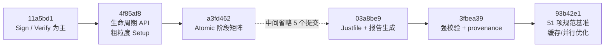

# 模块十三：从签名/验证到完整生命周期与原子阶段基准

> **历史版本与测量口径说明。** 本章记录的不是一次单独 commit 中完成的改造，而是三个连续版本所构成的演进链：`11a5bd1c62eee66878fafc0991f8250cde7756f5` 提供主要以 `Sign/Verify` 为中心的基线，`4f85af8168f3764d77dbc34179aff1b70b803703` 引入生命周期 API 与粗粒度 Setup 测量，`a3fd46203ab7d9dc5e0795e50146e4b25fd061d2` 再将其拆分成可独立测量的 Atomic 阶段。不同 commit 的结果不应脱离 CPU affinity、Rayon worker、Criterion 估计量和 timed region 直接混合比较。

## 一、比较目标与正确的版本边界

用户给出的 `4f85af8...` 是正确存在的 commit，提交信息为：

```text
4f85af8168f3764d77dbc34179aff1b70b803703
新增 PQCleanForCodeBasedZKP 子模块及其相关配置，完善setup等阶段
```

但如果要精确说明“最初主要只有签名和验证，后续才有 Setup、撤销等阶段的性能测试”，必须使用三个节点：

| 节点 | commit | 主要能力 | 基准粒度 |
|---|---|---|---|
| A | `11a5bd1c62eee66878fafc0991f8250cde7756f5` | 低层 relation 与签名/验证 fixture | 主要是 `Sign` / `Verify` |
| B | `4f85af8168f3764d77dbc34179aff1b70b803703` | 新增 lifecycle、PQClean McEliece、`GOpen`、FDABS update/revoke | 加入粗粒度 Setup，但多个子阶段仍合并在一起 |
| C | `a3fd46203ab7d9dc5e0795e50146e4b25fd061d2` | 将 lifecycle API 接入 Criterion Atomic suite | `Setup/KeyGen/Context/Issue/EpochInfo/UpdateRevoke/Open/Link/Sign/Verify` 可分别测量 |



因此，文档 13 对“只有 Sign/Verify”的比较基线选用 `4f85af8^`，即 `11a5bd1`；同时保留 `4f85af8` 和 `a3fd462` 两步中间过程，避免将 API 实现与 benchmark 拆分误写成同一步。

## 二、节点 A：主要只测签名与验证

### 2.1 早期 `paper_benchmarks.rs` 的典型结构

在历史 blob `11a5bd1:benches/paper_benchmarks.rs` 中，每个应用基本遵循以下模式。下面是对其 timed-region 结构的**结构化伪代码**，其中 `build_fixture` 是概括性名称，不是历史源码中的统一函数名：

```rust
// 测量前：构造矩阵、公钥、私钥、witness 和预签名
let (pk, sk) = build_fixture(...);
let signature = sign(...)?;

let mut sign_group = criterion.benchmark_group("..._sign");
sign_group.bench_function("sign", |b| {
    b.iter(|| sign(black_box(&pk), black_box(&sk), ...))
});

let mut verify_group = criterion.benchmark_group("..._verify");
verify_group.bench_function("verify", |b| {
    b.iter(|| verify(black_box(&pk), ..., black_box(&signature)))
});
```

这个边界适合回答“零知识签名和验证的在线耗时”，却无法回答以下问题：

- 生成公共矩阵描述和方案参数需要多少时间；
- 单个环成员的 `KeyGen` 与整个 Merkle `Context` 分别有多贵；
- 群签名的 Goppa `GSetup`、成员登记 `GKey` 和 `GOpen` 有何成本；
- FDABS 的 `Setupauth`、`AttrGen/Issue`、epoch 状态生成和 `Update/Revoke` 有何成本；
- Scope-LRS 的 `Link` 判定与签名/验证相比有多贵。

### 2.2 “Setup 信息被打印”不等于“Setup 被测量”

早期基准已经会打印类似以下文本：

```text
[Setup] B0/B1: each 40960 cols x 1280 rows
[Setup] Constraint gen skipped: formula count, implicit hot path only
```

这些信息只是 fixture 参数说明。由于矩阵、密钥、Merkle 路径等对象在 `b.iter(...)` 外构造，其耗时不在 Criterion timed region 中。

### 2.3 早期测量的语义

| 阶段 | 计时内容 | 计时外内容 |
|---|---|---|
| `Sign` | VOLE commit、relation proof、Fiat-Shamir、opening；部分旧基准还包含序列化 | 参数、密钥、witness/fixture |
| `Verify` | 签名解码及证明验证（以具体基准为准） | 有效签名的预生成 |
| Setup/KeyGen/Context/Open/Revoke | 未单独定义 | 大部分作为 fixture 一次性执行 |

这并不意味当时的数学 relation 缺少 Setup 所需的公共参数，而是说当时的**工程 API 与性能报告没有把系统生命周期拆出来**。

## 三、节点 B：`4f85af8` 引入生命周期架构

`4f85af8^..4f85af8` 的文件统计为 17 个文件、约 1250 行新增和 83 行删除。其中关键新增包括：

| 路径 | 变更 | 作用 |
|---|---|---|
| `src/apps/lifecycle.rs` | 新增 637 行 | RingSig 和 FDABS 的生命周期封装 |
| `PQCleanForCodeBasedZKP` | 新增 git submodule | 固定 [4096,3328,64] Goppa/PQClean 后端 |
| `src/pqclean_mceliece.rs` | 新增 Rust wrapper | 密钥生成、加密、Patterson 解密和 generator 提取 |
| `src/pqclean_mceliece_abi.c` | 新增 C ABI | 为 Rust 暴露固定 McEliece 接口 |
| `src/apps/group_signature_sig.rs` | 大幅扩展 | `GSetup -> GKey -> GSign -> GVerify -> GOpen` |
| `src/apps/linkable_ring_signature_sig.rs` | 扩展 scoped API | 从 context id 构造 link context，并提供 `Link` 判定 |
| `benches/paper_benchmarks.rs` | 新增粗粒度 setup group | 开始将签名前的工作纳入性能报告 |

### 3.1 RingSig 生命周期

`lifecycle.rs` 将原来由 benchmark 手工组装的 Merkle relation 拆成以下公共阶段：

```text
ring_setup_with_rng
        |
        v
ring_keygen_with_rng  -- 重复 2^ell 次 -->  ring_context
        |                                  |
        |                                  v
        +----------------------------> ring_sign
                                           |
                                           v
                                      ring_verify
```

| API | 输入/输出 | 主要计算 |
|---|---|---|
| `ring_setup_with_rng` | `ell,n,c -> RingParameters` | 为 `B0/B1` 生成 seed-backed 流式矩阵描述 |
| `ring_keygen_with_rng` | params + CSPRNG | 采样 `2n`-bit preimage，计算叶子公钥 |
| `ring_context` | `2^ell` 个成员公钥 | 构造 Merkle 树并输出 root |
| `ring_witness` | context + signer index + member secret | 重建路径方向位、路径节点与 siblings |
| `ring_sign` | lifecycle context + member key + message | 构造 witness 后调用低层 VOLEitH Ring relation prover |
| `ring_verify` | context + message + signature | 校验 root/context 后调用低层 verifier |

重要边界：这里的 `Setup` 创建的是 128-bit seed-backed 矩阵描述，不是把论文中的完整随机矩阵物化到内存。因此它是仓库实现边界下的 Setup 耗时。

### 3.2 GroupSig 生命周期

`4f85af8` 将 GroupSig 从“直接构造 relation fixture”提升为固定容量的群管理流程：

```text
GSetup
  |-- RingParameters
  |-- (opening_pk1, opening_sk1)
  `-- (opening_pk2, opening_sk2)
              |
              v
GKey: 生成 2^ell 个成员 + Merkle context + G1/G2
              |
              +--> GSign --> GVerify
              |
              `-----------> GOpen --> member index
```

| 阶段 | 主要计算 | 安全语义 |
|---|---|---|
| `group_setup_with_rng` / `GSetup` | Ring 参数 + 两份独立 Goppa opening keypair | 生成 group public setup 和 opener 私钥材料 |
| `group_keygen_with_rng` / `GKey` | 生成 `2^ell` 个成员、Merkle root、`G1/G2` | 建立固定成员集与 relation public key |
| `group_sign` | Merkle membership witness + 两份随机 McEliece 密文 + ZK proof | 成员匿名签名 |
| `group_verify` | 验证密文绑定和 VOLEitH relation | 公开验证 |
| `group_open` / `GOpen` | 先验签，再解密 `c1/c2`，要求两份 identity 一致 | 由 opener 恢复成员 index |

当时和当前实现都不应将 GroupSig 写成已具备“动态成员撤销”：这是固定 `2^ell` 成员的研究型 lifecycle，具有 `Open`，但没有 group revocation protocol。

### 3.3 FDABS 生命周期

`FdabsAuthority` 开始管理 registry、active flags、next index 和 epoch：

```text
fdabs_setup_with_rng
        |
        v
issue_attribute_with_rng  -->  epoch_info
        |                         |
        |                         +--> fdabs_sign / fdabs_verify
        v
revoke(indices)  -----------------+
        |
        `--> epoch := epoch + 1, new root/state
```

| API | 对应论文阶段 | 当时实现内容 |
|---|---|---|
| `fdabs_setup_with_rng` | `Setupinit + Setupauth` 的本地 PoC 封装 | 生成 `B0/B1/B_leaf` 描述、零叶 registry、active flags |
| `issue_attribute_with_rng` | `AttrGen` | 采样 commitment randomness，直到得到奇 Hamming weight leaf，登记 attribute |
| `epoch_info` | 构造/发布 `info_tau` 的本地对象 | 由 registry 构树，得到 root、leaves、active snapshot |
| `revoke` | `Update(msk,S,info,reg)` | 拒绝非 active index，将对应叶清零，epoch 加一并输出新 epoch info |
| `fdabs_sign` | `Sign` | 生成 Merkle path，检查 policy，组装 relation witness 并证明 |
| `fdabs_verify` | `Verify` | 绑定 root、epoch、message、system info 和 policy relation |

这一步的重点是将“用户密钥中预先存放一条路径”改成“从当前 epoch 状态导出路径”，从而使撤销后的旧签名与新 epoch 能够被区分。

### 3.4 Scope-LRS 的 lifecycle 封装

`4f85af8` 补充了以下 API：

- `build_linkable_context`：由 ring public key 和 scope/context id 派生 link matrix/context；
- `sign_lrs_scoped`：在指定 scope 下签名；
- `verify_lrs_scoped`：验证 scope-bound 签名；
- `signatures_linked`：只在 scope 一致时根据 key image 判断可链接性。

Scope-LRS 和 Batch Scope-LRS 是仓库扩展，不是论文主要应用列表中的新方案。

## 四、`4f85af8` 中已有 Setup，但仍是粗粒度测量

`4f85af8` 确实首次在旧 benchmark group 中新增了 Setup 耗时：

| 方案 | 当时的 benchmark 名 | 合并计时的工作 |
|---|---|---|
| RingSig | `setup_and_membership_context` | 生成 setup 参数、成员 fixture 和 Merkle context |
| Scope-LRS | `setup_context_and_key_image` | 构造 ring fixture、scope context 和 key image |
| GroupSig | `gsetup_and_gkey` | 两套 Goppa keypair + 全部成员 + Merkle tree + generator matrices |
| FDABS | `setup_and_attribute_context` | 构造公共 relation fixture 和 attribute context |

这已经比只测 `Sign/Verify` 完整，但它仍无法回答例如“GroupSig 的耗时究竟来自 Goppa keypair 还是 1024 个成员 KeyGen”、“FDABS 的耗时来自 Issue 还是 EpochInfo/Revoke”。

## 五、节点 C：`a3fd462` 引入 Atomic 阶段矩阵

`4f85af8..a3fd462` 只修改 4 个文件，主体是为 `paper_benchmarks.rs` 新增约 85 行原子阶段测量。它首次明确定义：

```text
Atomic/RingSig_ell{5,10}/...
Atomic/ScopeLRS_ell{5,10}/...
Atomic/GroupSig_ell{5,10}/...
Atomic/FDABS_ell{5,10}/...
```

### 5.1 阶段覆盖矩阵

| 方案 | Setup | KeyGen / Issue | Context / EpochInfo | Sign | Verify | 扩展操作 |
|---|:---:|:---:|:---:|:---:|:---:|---|
| RingSig | yes | `KeyGen` | `Context` | yes | yes | - |
| Scope-LRS | yes | `KeyGen` | `Context` | yes | yes | `Link` |
| GroupSig | `GSetup` | `GKey` | - | yes | yes | `Open` |
| FDABS | `Setup` | `Issue` | `EpochInfo` | yes | yes | `UpdateRevoke` |

在 `ell=5` 和 `ell=10` 两组参数下，这一矩阵共有：

$$
2\times(5_{Ring}+6_{LRS}+5_{Group}+6_{FDABS})=44
$$

个 Atomic Criterion 指标。后续当前版本再加入 ReSolveD+ 的 4 项和 Batch Scope-LRS 的 3 项，才形成 51 项规范表。

### 5.2 为什么使用 `iter_batched`

`KeyGen`、`Context`、`Issue`、`UpdateRevoke` 不能在同一个可变对象上无限重复，否则会遇到：

- RNG 状态不同；
- registry 容量被用完；
- 同一成员/属性被重复撤销；
- 树的当前状态随迭代次数变化。

因此 Atomic suite 使用 Criterion `iter_batched(setup, routine, BatchSize::SmallInput)`：

```rust
b.iter_batched(
    || {
        // 计时外：为每个样本构造独立、有效的前置状态
        let state = prepare_state();
        state
    },
    |state| {
        // 计时内：只执行被报告的那个阶段
        black_box(operation(state))
    },
    BatchSize::SmallInput,
)
```

这是原子阶段可比的基础，也意味着阅读结果时必须区分 setup closure 和 timed routine。

### 5.3 每个 timed region 的精确语义

| 指标 | timed region | 明确排除的前置工作 |
|---|---|---|
| Ring `Setup` | 参数校验 + `B0/B1` seed descriptor | 成员 KeyGen、树构造 |
| Ring `KeyGen` | 采样 preimage + 计算成员 leaf | Ring setup |
| Ring `Context` | 对既定公钥集构造整棵 Merkle 树 | `2^ell` 个成员 KeyGen |
| Ring `Sign` | 路径/witness 导出 + relation proof | setup、成员生成、context |
| Ring `Verify` | context/root 检查 + relation verify | 签名生成 |
| Scope-LRS `Context` | 从 ring + scope id 构造 link context | ring 成员和 root |
| Scope-LRS `Link` | 比较 scope 与 key image | 两份签名生成 |
| Group `Setup` | Ring setup + 两套 Goppa keypair | 成员登记和 generator 物化 |
| Group `KeyGen` | 全部成员 KeyGen + Merkle context + `G1/G2` | GSetup |
| Group `Open` | 验签 + opener 绑定检查 + 两次解密 | 签名生成 |
| FDABS `Setup` | 参数 + 空 registry 状态 | attribute issue |
| FDABS `Issue` | commitment randomness 采样 + 奇权 leaf 计算 + 登记 | authority setup |
| FDABS `EpochInfo` | 由当前 authority 输出 epoch snapshot | setup 和 issue |
| FDABS `UpdateRevoke` | 撤销一个 active index + epoch 递增 + 新 snapshot | setup、issue 和使状态可撤销的准备 |

## 六、从 44 项到当前 51 项的补全

`a3fd462` 的 Atomic suite 尚未把 ReSolveD+ 和 Batch Scope-LRS 纳入统一阶段表。本文审查终点 `93b42e12684e9f919c873bad710f67db497603a5` 新增：

| 方案 | 新增指标 | 说明 |
|---|---|---|
| ReSolveD+ | `StreamingSetup` / `KeyGen` / `Sign` / `Verify` | `StreamingSetup` 只创建 RE table 和 seed-backed `B` 描述，不是物化全矩阵 |
| Batch Scope-LRS | `FixtureBuild` / `Sign` / `Verify` | 10 个异构 statement；`FixtureBuild` 是仓库 fixture 成本，不是论文协议 Setup |

于是：

$$
44+4+3=51.
$$

在 `93b42e12684e9f919c873bad710f67db497603a5` 中，`just bench-both` 的每一种模式都必须产生这 51 个 Atomic 指标；`required_atomic_sources()` 所列项目缺一项时，报表解析器拒绝生成“完整表”。

## 七、与论文算法的对应与实现边界

### 7.1 管理阶段不等于新增一份 ZK proof

Setup、KeyGen、Context、Issue、EpochInfo、Update、Revoke 是签名系统的生命周期管理阶段。它们为后续 `Sign` 构造公开 statement 和秘密 witness，不会把顶层 VOLEitH proof 数量翻倍。

所以，“原子阶段变多”与“签名中的证明对象变多”是两个完全不同的概念。

### 7.2 FDABS 的 Update 对应 Merkle `TUpdate`

论文 Appendix C.6 的 `Update` 要求：

1. 对每个要撤销的 attribute 将叶子更新为 `0^n`；
2. 更新 Merkle root；
3. 推进 epoch；
4. 发布新 root 和活跃 attribute 的路径信息。

`4f85af8` 已实现“清零叶子、推进 epoch、导出新 root/state”的本地 PoC 语义。审查终点 `93b42e1` 的 `update_fdabs_tree_leaves()` 将其优化为只重算受影响路径，但 relation 中仍证明同一个 root、leaf commitment、attribute、randomness 和 policy circuit。

### 7.3 当前 warm-cache 语义不应回写到早期数据

Atomic `EpochInfo/UpdateRevoke` 的 timed boundary 自 `a3fd462` 建立后基本保持稳定。但在早期实现中，`epoch_info()` 每次重建整树；`93b42e1` 会缓存树，而 benchmark 恰好在计时前调用过一次 `epoch_info()`。

因此当前的指标实际是：

- `WarmEpochInfo`；
- `WarmIncrementalUpdateRevoke`；预热产生的旧 snapshot 被立即丢弃，所以 timed routine 不包含“调用方仍持有旧 snapshot 时，`Arc::make_mut` 先克隆完整 tree”的成本。生产实现本身仍支持并保留旧 epoch snapshot。

不能将它们追溯性地解释成早期 commit 也在测 warm cache，更不能把当前的大倍率写成所有 cold/无状态场景的普遍提升。

## 八、可复现的历史核查命令

以下命令不修改工作树，可用来复核本章结论：

```bash
# 查看三个节点的提交信息
git show -s --format=fuller 11a5bd1c62eee66878fafc0991f8250cde7756f5
git show -s --format=fuller 4f85af8168f3764d77dbc34179aff1b70b803703
git show -s --format=fuller a3fd46203ab7d9dc5e0795e50146e4b25fd061d2

# 查看从 Sign/Verify 到粗粒度 Setup 的改动
git diff 4f85af8^..4f85af8 -- benches/paper_benchmarks.rs src/apps/lifecycle.rs

# 查看 Atomic 阶段首次加入
git diff 4f85af8..a3fd462 -- benches/paper_benchmarks.rs

# 复核正文使用的精确 diff 规模
git diff --shortstat 4f85af8^ 4f85af8
git diff --shortstat 4f85af8 a3fd462

# 查看历史版本的所有 benchmark 名
git show a3fd462:benches/paper_benchmarks.rs | rg 'bench_function'
```

## 九、演进总结

这段历史不是简单的“多打几个时间戳”，而是性能对象的根本变化：

1. `11a5bd1` 的性能对象主要是已经拥有 fixture 时的在线 `Sign/Verify`；
2. `4f85af8` 将仓库提升为有 Setup、成员/属性生成、系统状态、开封和撤销 API 的研究型签名系统；
3. `a3fd462` 才将这些 API 拆成可单独归因的 44 个 Atomic 指标；
4. `93b42e1` 补全 ReSolveD+ 和 Batch Scope-LRS，形成每种模式 51 项的完整表；
5. 后续缓存和并行优化改变了部分 timed region 内的复杂度，所以性能数据必须和具体 commit、冷/热状态、并发拓扑一起引用。
