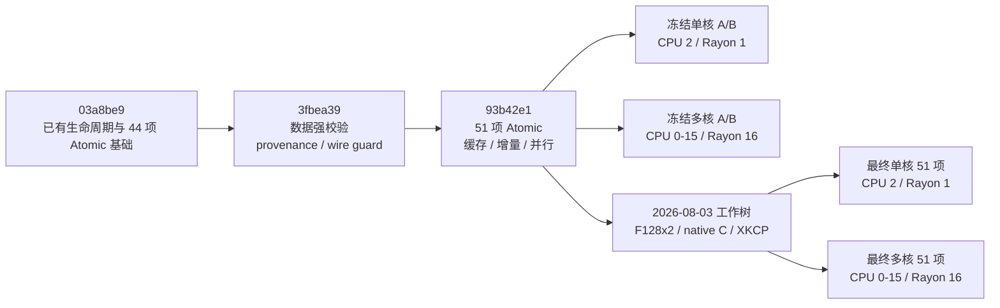

# 模块十四：从 `03a8be9` 到 `93b42e1` 的基准可信度与性能优化演进

> **版本与证据边界。** 本章的静态代码基线是 `03a8be9b53a08e575627d5096f103f9fd2b9c2ec`，中间节点是 `3fbea395a3f62991414d06abd7549bdef3d8ec3a`，已提交审查终点是 `93b42e12684e9f919c873bad710f67db497603a5`。三者位于同一条一阶父提交链上。第十三节继续审查以 `93b42e1` 为 HEAD 的 2026-08-03 未提交 SIMD/native-C 工作树；对应最终性能可执行文件的 `source-worktree.patch` SHA-256 为 `c971dec55454fd1698716975d6a37735b1231a7c3ab6d8a63cb805eb47f07d40`。本章的文档补写发生在该轮测量之后，不属于被测二进制。代码 diff、历史提交说明、论文 PDF 和同机 A/B 实测是四类不同证据；只有同机 A/B 数据用于给出性能倍率，不能用静态代码行数推导速度。

> **核心结论。** `3fbea39` 主要解决“报告是否可信、失败是否会被静默吞掉、公式与实测是否混淆”；`93b42e1` 主要解决“完整 51 项 Atomic 指标、Merkle 树重复构造、GroupSig 批量工作、McEliece generator 转置和可复现的前后对照”；2026-08-03 工作树进一步用两路 `VPCLMULQDQ`、显式 native-C opt-in 和固定版本 XKCP 后端优化有限域与 bundled C 热点。对论文 PDF 的逐页复核没有发现该工作树新增 relation、参数、Fiat–Shamir transcript、proof 数量或 wire 格式偏差；已有 PoC/论文边界仍须继续披露，不能因性能改善而删除。

## 一、比较目标、提交时间线与取证方法

### 1.1 三个提交节点与一个后续工作树

| 节点 | 完整 commit | 提交时间（`+08:00`） | 主要职责 | 相对前一节点的规模 |
|---|---|---:|---|---:|
| 基线 | `03a8be9b53a08e575627d5096f103f9fd2b9c2ec` | 2026-07-31 21:22:26 | 清理旧说明，扩展当时的 just 测试入口 | 本章起点 |
| 中间节点 | `3fbea395a3f62991414d06abd7549bdef3d8ec3a` | 2026-08-02 18:59:44 | 报表强校验、provenance、single-proof/wire 回归保护 | 16 files，`+629/-138` |
| 审查终点 | `93b42e12684e9f919c873bad710f67db497603a5` | 2026-08-02 22:20:00 | 51 项 Atomic、缓存、增量更新、并行和 A/B 冻结工作流 | 11 files，`+2097/-283` |
| 后续性能工作树 | HEAD 仍为 `93b42e12684e9f919c873bad710f67db497603a5`；patch `c971dec...` | 2026-08-03 | F128x2、paired butterfly、native C、XKCP AVX2 和后端取证 | 被测源码 9 files，`+463/-105` |

直接比较 `03a8be9..93b42e1` 的总规模为：

```text
24 files changed, 2668 insertions(+), 363 deletions(-)
```

这 24 个文件可分为四层：

| 层次 | 代表文件 | 变化性质 |
|---|---|---|
| 可信度与声明边界 | `LIMITATIONS.md`、`README*.md`、`FUTURE_FEATURES.md`、`tests/extrapolation.rs` | 区分 `[Measured]`、`[Formula]`、`[Hardcoded External Baseline]`，固定 single-proof 与 soundness 解释 |
| 基准基础设施 | `justfile`、`scripts/bench_table.py`、`benches/paper_benchmarks.rs`、`tests/test_benchmark_scripts.py` | 隔离数据目录、51 项完整性检查、环境指纹、冻结 baseline、逐阶段 speedup |
| 生产热路径 | `src/apps/lifecycle.rs`、`src/apps/group_signature_sig.rs`、`src/pqclean_mceliece.rs`、`src/primitives/afs_hash.rs`、`src/core/constraint_gen.rs` | Merkle 缓存、增量更新、批量并行、矩阵转置、RE 表缓存 |
| 兼容性回归 | `src/core/wire.rs`、`tests/cli_process.rs`、`tests/single_proof_regression.rs` | 防止默认路径悄然增加第二份 proof 或升级 wire/bundle 版本 |

上表最后一行的 `+463/-105` 只统计最终性能二进制对应的九个 tracked 源码/benchmark 文件，不包含测量后新增的性能报告和本章补写。它不是一个新 commit，不能写成 `93b42e1` 的提交内容。

### 1.2 证据等级

本章使用以下标记，防止把不同口径混成同一种结论：

- `[Git diff]`：由指定 commit 的源码差异直接确认；适合说明“改了什么”，不单独证明“快了多少”。
- `[Recorded A/B]`：读取本机冻结 Criterion JSON 的 `median.point_estimate`；适合说明这一次受控实验观察到的倍率。
- `[Historical snapshot]`：历史日志、提交说明或根目录性能报告中的记录；必须同时固定 commit、CPU、线程和估计量。
- `[Inference]`：根据调用图或复杂度作出的解释；必须与实测结果分开写。

### 1.3 必须保持的协议不变量

`03a8be9..93b42e1` 没有修改以下协议核心文件：

- `src/core/protocol_dd_rep.rs`；
- `src/core/voleith.rs`；
- `src/core/transcript.rs`；
- FAEST C/Rust profile 定义与 BAVC/GGM 状态机。

`src/core/wire.rs` 在 `3fbea39` 中只新增测试模块，没有修改 encoder/decoder 的生产逻辑。因此本轮的目标不是用不同参数或第二份 proof 换性能，而是在相同 relation 和线材边界下减少重复工程工作。



## 二、总体差异矩阵

| 维度 | `03a8be9` | `3fbea39` | `93b42e1` | 技术影响 |
|---|---|---|---|---|
| Criterion 数据目录 | 容易共享默认 `target/criterion` | 每轮独立 `CRITERION_HOME`，`.latest` 指向完整轮次 | 冻结 before/after 指针，不允许覆盖 | 防止不同轮次或不同 baseline 混读 |
| 数据集完整性 | 缺项可能以 `—` 出现在表中 | 44 个 Atomic 必须完整；ReSolveD+/Batch 补充组全有或全无 | ReSolveD+/Batch 纳入统一 Atomic，固定 51 项 | 缺任一项即拒绝生成完整表 |
| 估计量 | 文档与控制台输出容易混用 | 强制读取 JSON `median.point_estimate` | 同时生成逐阶段 before/after/speedup | 估计量可审计，不再猜控制台区间 |
| 数据来源标签 | 公式、论文值和实测容易并列而无标签 | 全面加入 provenance 标签 | A/B 列明确 `[Measured]` 与 `[Formula]` | 避免把 256-bit 公式值写成运行结果 |
| 失败策略 | 端到端 case 超时后可能最终返回成功 | timeout/parse failure 累计并最终非零退出 | 冻结发布还检查环境与 51 项完整性 | 从“尽量出表”转为 fail closed |
| Ring 生命周期 | Sign/Verify 重建 Merkle tree | 不变 | `RingContext` 缓存完整 levels 并校验 public snapshot | 在线阶段不再重复哈希整树 |
| FDABS epoch | 每次 `epoch_info/sign/verify/revoke` 可触发整树重建 | 不变 | 惰性缓存、路径增量更新、`Arc::make_mut` 旧快照保护 | steady-state 从整树重算降为路径更新 |
| GroupSig KeyGen/Open | 成员串行；generator 逐 bit 转置；Open 重建两套 generator | 不变 | 外层成员并行、8x8 转置、Open 使用构造时快照、双解密并行 | 主要改善 GKey/GOpen 与多核利用率 |
| RE 约束表 | lifecycle 每次 `compile_re_constraints` | 不变 | `c<=8` 进程级 canonical cache；大 `c` 仍 owned | 避免重复编译，同时限制常驻内存 |
| API 构造方式 | `RingContext`/`FdabsEpochInfo` 可由外部 struct literal 伪造 | 不变 | 新增私有缓存字段；公开 epoch 用 `from_public_snapshot` 重建 | 更强一致性，但存在 Rust 源码兼容性变化 |

## 三、`3fbea39`：先修复“实验能否被相信”

`3fbea39` 没有修改生命周期生产热路径。它的中心问题是：即使密码学代码正确，如果脚本会混读 baseline、缺项仍出表、超时仍返回成功，最终性能结论仍不可复现。

### 3.1 Criterion 数据集从“尽量读取”改为“精确读取”

`scripts/bench_table.py` 在这一节点引入 `DatasetValidationError`，并建立以下规则：

1. `selected_tag` 只接受单个 baseline/tag 名，拒绝 `.`、`..` 和路径形式；
2. 请求某个 baseline 时，只读 `group/function/<baseline>/estimates.json`；
3. 即使同目录存在 `new/`，指定 baseline 缺失时也绝不回退；
4. 所有必需 Atomic `(group,function)` 必须存在；
5. ReSolveD+ 与 Batch Scope-LRS 当时仍是补充组，因此要求“四项全有或全无”，禁止从另一轮拼接；
6. JSON 必须包含数值型、有限、非负的 `median.point_estimate`，布尔值、字符串、NaN、Infinity 和负数均无效；
7. 纳秒值只在解析成功后统一除以 $10^6$ 转为毫秒。

这里的“median”不是控制台 `time: [low, typical, high]` 中任意一项的文本抓取，而是 Criterion 结果文件中的：

```text
median.point_estimate
```

### 3.2 每轮独立目录，阻止跨轮残留

`3fbea39` 的 `bench-single` / `bench-parallel` 开始为每次运行创建：

```text
target/bench_tables/criterion_runs/<baseline>.<random>/
```

并将 `CRITERION_HOME` 指向该目录。只有 benchmark 和表格解析都成功后，才更新：

```text
target/bench_tables/criterion_runs/<baseline>.latest
```

这解决了默认 `target/criterion` 的典型污染场景：旧 `new/`、新 baseline 和中断轮次同时存在时，解析器不再“找到什么就用什么”。

### 3.3 端到端脚本改为失败闭合

`scripts/paper_speed_table.sh` 的旧逻辑在单个 case 超时或解析失败时输出 `TIMEOUT/FAIL` 后 `return`，脚本仍可能以零状态结束。`3fbea39` 新增全局 `CASE_FAILURES`：

- timeout 的真实退出码写入表格；
- 缺少 Sign/Verify 字段计为 parse failure；
- 继续渲染其余行，以便诊断多个失败；
- 末尾只要 `CASE_FAILURES>0` 就退出 1。

这是一种“保留诊断信息，但拒绝发布不完整成功状态”的策略。新建的 Python 回归测试使用假的 `timeout` 命令返回 124，验证 `just speed-table` 最终必须非零退出。

### 3.4 `[Measured]`、`[Formula]` 与外部基线分离

`tests/extrapolation.rs`、`README*` 和 `LIMITATIONS.md` 在 `3fbea39` 中统一了来源标签：

| 标签 | 含义 | 典型例子 |
|---|---|---|
| `[Measured]` | 当前可执行实现实际运行或编码得到 | Criterion 时间、3159-byte canonical signature、3292-byte CLI bundle |
| `[Formula]` | 根据参数和论文公式计算 | 256-bit 列、FDABS 大参数尺寸、speedup/improvement |
| `[Hardcoded External Baseline]` | 从论文或引用文献转录 | Table 7 的 3054 bytes、Stern 类对比值 |

同时明确以下边界：

- 当前是可执行的 128-bit PoC，不是 256-bit 完整实现；
- Table 4 的表头单位写作 `KB`，published GroupSig `ell=5` 数值为 49.60；仓库按 1024 bytes/KiB 计算的正文一致 `c_hash=8,c_e=6,k=384` 公式为 50.60 KiB；单位口径与数值差异均不能静默合并；
- `q=2^8,tau=16` 的应用参数仍是一份 proof；优化 ReSolveD+ 的 `tau=10` 也是论文中的另一参数 profile，不是外层重复；
- degree 9 的完整 128-bit Delta 域 Theorem 1 bound 约为 124.678 bits，不能改称“严格 128-bit theorem bound”。

### 3.5 single-proof 与 wire v1 回归保护

`3fbea39` 新增三类保护，但没有改变 wire：

1. `tests/single_proof_regression.rs` 对六种签名结构做穷尽字段解构；若默认结构静默增加第二个 commitment/proof/VOLE transcript，测试会在编译期失败；
2. `src/core/wire.rs` 的测试固定 `MAGIC="CBZKVSIG"`、`VERSION=1`、reserved field 为 0，并固定 `CommonSignatureParts` 只有一组 `commitment/proof/vole`；
3. `tests/cli_process.rs` 固定 3159-byte ReSolveD+ signature 与 3292-byte public bundle，拒绝 bundle v2、signature v2、非零 reserved、非规范尾 bit、截断和 trailing bytes。

所以，`3fbea39` 的作用是把“本轮优化不得偷换协议对象”变成可执行回归条件。

### 3.6 `3fbea39` 仍未解决的缺口

该版本的主表仍只有文档 13 所述的 44 个 Atomic 指标。ReSolveD+ 与 Batch Scope-LRS 的 Sign/Verify 只能来自非 Atomic 粗粒度组；默认 `--bench Atomic` 时仍可能显示 `—`。因此它解决了“已有数据不能被混读”，但尚未形成统一的 51 项阶段矩阵。

### 3.7 其余工程与发布变更

该提交还包含几项不改变密码学算法、但影响复现可达性的改动：

- `.gitmodules` 将 `PQCleanForCodeBasedZKP` 从 GitHub SSH URL 改为 HTTPS，审稿环境不再必须预配个人 SSH key；
- `.gitignore` 增加 `__pycache__/`、`*.py[cod]` 和 `tmp/`，避免脚本测试缓存进入 source fingerprint；
- 新增 `FUTURE_FEATURES.md`，把 256-bit backend、严格 soundness 变体、大参数 FDABS、动态外部基线和完整 lifecycle service 明确放入未来范围；
- `README.md`、`README_cn.md`、`REVIEWER_EXPERIMENTS.md` 与 `LIMITATIONS.md` 同步 single-proof、wire accounting、GroupSig Table 4 差异和应用范围，避免代码测试与发布声明互相矛盾。

## 四、`93b42e1`：把完整指标与可复现 A/B 固化下来

### 4.1 从 44 项补到 51 项

`benches/paper_benchmarks.rs` 新增：

| 方案 | Criterion group | 新增步骤 | 精确语义 |
|---|---|---|---|
| ReSolveD+ | `Atomic/ReSolveDPlus` | `StreamingSetup/KeyGen/Sign/Verify` | `StreamingSetup` 创建 RE 表和 seed-backed `B` 描述，不物化论文完整矩阵 |
| Batch Scope-LRS | `Atomic/ExtensionBatchScopeLRS_batch10_ell5_ring32` | `FixtureBuild/Sign/Verify` | 十个独立 ring statement；fixture 不是论文协议 Setup |

总数变为：

$$
4+2\times(5_{Ring}+6_{ScopeLRS}+5_{Group}+6_{FDABS})+3=51.
$$

`PAPER_BENCH_SUITE=atomic` 时，旧的粗粒度 benchmark 函数在构造昂贵 fixture 前立即返回，只注册和运行规范 Atomic suite。这样 `--bench Atomic` 不再因为 Criterion 过滤发生在函数初始化之后而先付出无关 fixture 成本。

### 4.2 报表 schema 由“44+可选补充”改为“51 项不可分割集合”

`SCHEME_ROWS` 现在直接包含 ReSolveD+ 和 Batch Scope-LRS。`required_atomic_sources()` 对表格每个非空单元格展开 `(group,function)` 并去重，完整数据集恰好包含 51 项。

解析器的新行为是：

- 缺少 ReSolveD+ 任一步骤：整轮失败；
- 缺少 Batch Scope-LRS 任一步骤：整轮失败；
- Batch Sign/Verify 同时显示 ms/batch 与 ms/item；其中 ms/batch 是 `[Measured]` 的 Criterion median，ms/item 是将该 median 除以 10 得到的 `[Formula: amortized]`，不是十个 item 的独立实测分布；
- `FixtureBuild` 明确标为测试夹具成本；
- Scope-LRS 与 Batch Scope-LRS 标为仓库扩展，不并入论文四个应用声明。

### 4.3 `justfile` 从“运行命令集合”升级为“冻结实验事务”

正式路径可概括为：

```text
_bench-build
  -> 从 Cargo JSON 精确选唯一 paper_benchmarks executable
  -> _bench-stabilize 检查 runnable tasks / package temperature
  -> 保存 source-status / source-worktree.patch / source-index.patch
  -> _bench-env 写 environment.txt，并记录 source patch 与 binary SHA-256
  -> taskset + 独立 CRITERION_HOME 运行 51 项
  -> _bench-env 写 environment_after.txt
  -> 解析器检查 pre/post 稳定性和完整性
  -> 原子发布 <baseline>.latest
```

关键检查包括：

- 单核必须绑定一个逻辑 CPU，且本机 `cpuinfo_max_freq>=4 GHz`，用于排除 E-core；
- 多核 CPU set 必须严格等于所有 online CPU；
- `RAYON_NUM_THREADS` 必须等于 affinity 中的逻辑 CPU 数；
- `RUST_TEST_THREADS=1`，`LC_ALL=C`、`LANG=C`、`TZ=UTC`；
- governor、EPP 和 Turbo 策略必须符合预期；
- 记录 commit/tree、dirty 状态、包含“未被 `.gitignore` 排除的未跟踪文件”的 worktree fingerprint、source patch SHA；
- 记录 Rust/Cargo/kernel/CPU、Rust/C/C++ flags、allocator 环境、Cargo.lock SHA；
- 记录 Criterion sample size、warm-up、measurement、filter、suite、baseline；
- 正式采样前后 source fingerprint、binary hash 和受控环境必须保持稳定。

`bench-baseline` 与 `bench-optimized` 使用四个冻结标签：

```text
mechanism_before_single_pcore
mechanism_before_all_cores
mechanism_after_single_pcore
mechanism_after_all_cores
```

冻结 `.latest` 指针不允许覆盖；中途中断后只补跑缺失模式。`bench-compare` 只有在两轮的可比环境字段完全一致时才输出逐步骤 speedup。

### 4.4 speedup 的公式边界

对每个步骤，报表计算：

$$
\text{speedup}=\frac{T_{before}}{T_{after}},\qquad
\text{improvement}=\frac{T_{before}-T_{after}}{T_{before}}\times100\%.
$$

时间列是 `[Measured]`，上述两列是由实测值计算的 `[Formula]`。负 improvement 原样保留，不会被截成 0 或从表中删除。

## 五、生产代码的机制级优化

### 5.1 RingContext：从每次整树重建到构造时缓存

在 `3fbea39:src/apps/lifecycle.rs` 中，`RingContext` 只有 `members/root`。调用路径为：

```text
ring_sign -> ring_witness -> build_tree(all members)
ring_verify             -> ring_context(cloned members) -> build_tree(all members)
```

也就是说，Context 已经计算过一次 root，但每次 Sign 和 Verify 又从全部 leaves 重建整棵树。

`93b42e1` 为 `RingContext` 增加私有字段：

```rust
levels: Arc<Vec<Vec<MainBitVec>>>,
cache_params: RingParameters,
```

新路径为：

```text
ring_context -> build_tree once -> Arc<levels>
ring_sign -> validate public snapshot -> read path from cached levels
ring_verify -> validate public snapshot -> verify relation
```

缓存不是未经验证的旁路。`validate_ring_context_cache` 仍检查：

1. `B0/B1/ell/n/c` 与构造时参数完全相同；
2. level 数量和每层节点数符合完美二叉树形状；
3. 当前公开 `members` 与 cached leaves 逐项完全相同；
4. 当前公开 `root` 等于 cached root。

因此，外部代码即使修改公开 `members/root`，也不能让 Sign/Verify 在旧缓存和新 statement 之间错配。

### 5.2 Merkle 层并行

`hash_tree_level` 对公开 child pairs 使用两条路径：

- 单 worker 或 parent pair 数小于 32：顺序 `chunks_exact(2)`；
- 多 worker 且至少 32 对：Rayon `par_chunks_exact(2)`。

对 `ell=5`，底层只有 16 对，保持串行以避免调度开销；对 `ell=10`，底部 512、256、128、64、32 对可并行，上层自动回到串行。这一阈值解释了多核 RingSig `ell=10` Context 明显改善，而 `ell=5` 变化较小。

### 5.3 批量 Ring KeyGen：先固定 RNG 顺序，再做外层并行

`ring_keygen_batch_with_rng` 不让多个 Rayon task 共享或争用同一个 RNG，而是：

1. 在调用线程按原顺序预采样 `count` 个 `2n`-bit preimage；
2. `count>=8` 且 worker>1 时，对这些已固定输入并行求 member public key；
3. 外层并行 task 调用 `afs_hash_streaming_ct_serial`，避免每个成员内部再次产生 Rayon task；
4. 按输入顺序 collect，保持成员 index 不变。

测试对 1/4 workers 和 `count=0,1,7,8,9` 比较逐个公私钥，并继续从两个 `StdRng` 读取 32 bytes 进行尾状态比较。对这些固定 case，后者锁定的不只是输出相同，也包括随机数消耗次数与顺序相同；它不是对任意第三方 RNG 实现的普遍证明。

### 5.4 FDABS：惰性树、增量路径与旧 epoch 快照

旧实现中的以下操作都会调用 `fdabs_tree`：

- `epoch_info()`；
- `fdabs_path()`，因此影响 Sign；
- `fdabs_verify()`；
- `revoke()` 最后返回新 `epoch_info()`。

`93b42e1` 的 `FdabsAuthority` 增加：

```rust
levels: RwLock<Option<Arc<Vec<Vec<MainBitVec>>>>>,
```

状态转换如下：

```text
Setup -> levels=None
first Issue -> 若 levels=None，仍不构树
first EpochInfo -> 构造整树一次并放入 Arc
later EpochInfo -> 复用 Arc
Issue/Revoke after cache -> Arc::make_mut + 只更新受影响路径
```

`update_fdabs_tree_leaves` 先拒绝越界、错误位宽和重复 index，再对每一层将受影响 index 右移、排序、去重，只重算真正受影响的 parent。**当 cache 已经物化**时，撤销 $r$ 个叶子的更新工作最多为 $O(r\ell)$ 个 parent hashes；共享祖先会进一步去重。若 `levels=None` 就直接调用 `revoke`，更新阶段没有 tree 可增量修改，函数末尾的 `epoch_info()` 仍会执行一次 $O(2^\ell)$ cold build。

`Arc::make_mut` 给出了明确的快照语义：

- cache 已物化且没有旧 `FdabsEpochInfo` 持有 tree 时，原地增量更新；
- 旧 epoch snapshot 仍被持有时，先复制完整 tree，再增量更新新版本；
- 旧 snapshot 继续验证旧签名，新 snapshot 反映撤销后的 root/active/epoch。

`FdabsEpochInfo` 还保存私有 `cached_active/cached_epoch/cache_params`。`from_public_snapshot` 是公开传输边界：外部 verifier 提供 `epoch/root/leaves/active`，函数只构树一次并验证 leaves、长度与 root 的内部一致性，之后复用**内部一致缓存**。它不认证 snapshot 是否由合法 authority 发布；authenticated epoch publication 仍属于仓库明确披露的系统边界。

### 5.5 canonical RE 表的有界进程缓存

旧 lifecycle Sign/Verify 每次调用 `compile_re_constraints(c)`。该表有 $2^c$ 行、每行 $2^c$ bits，系数位规模为 $4^c$。

`canonical_re_constraints(c)` 的新策略是：

| `c` | 返回类型 | 生命周期 | 原因 |
|---:|---|---|---|
| `1..=8` | `Cow::Borrowed` | `OnceLock` 进程级只读缓存 | 覆盖所有论文 profile；`c=8` 系数位仅 8 KiB |
| `>8` | `Cow::Owned` | 调用结束后可释放 | 防止 `c=16` 的约 512 MiB 系数位永久钉在全局缓存 |

`validate_re_constraints` 对缓存范围先做 canonical slice 精确相等快路径；如果不相等，仍执行逐 row/monomial 诊断，不能用错误表绕过验证。

### 5.6 GroupSig：GSetup、GKey 与 GOpen 的组合优化

GroupSig 的变化由多个独立机制组成：

| 阶段 | 旧路径 | 新路径 |
|---|---|---|
| `GSetup` | 两份 McEliece keypair 顺序生成 | 多 worker 时 `rayon::join` 并行生成两份独立 keypair |
| 成员 KeyGen | 循环调用单成员 KeyGen | RNG 预采样后外层批量并行，内层 CT kernel 串行 |
| Merkle Context | 每层所有 pair 串行 | 大层并行、小层串行 |
| `G1/G2` | 两套 generator 顺序构造 | 多 worker 时两套 generator 并行构造 |
| manager/setup key 所有权 | 大型 key `Vec<u8>` 多次深拷贝 | `Arc<OpeningPublicKey/SecretKey>` 共享不可变 key |
| `GOpen` key 绑定 | 每次从两份 opening pk 重建 generator 后与 `G1/G2` 比较 | 两条独立检查：当前 `context.public_key` 与构造时 snapshot 做 exact matrix/metadata compare；manager opening pk raw bytes 与 context 保存的构造时 opening pk 比较 |
| Patterson decode | 两个 ciphertext 顺序解密 | 多 worker 时两次独立 decode 用 `rayon::join` |

`GOpen` 仍先完整调用 `group_verify`，然后才做 manager 绑定和两次解密。因此 `Open` 指标不是“纯 Patterson decode”，它同时包含 Verify、public snapshot 比较和 identity 一致性检查。

### 5.7 McEliece generator 的 8x8 block transpose

固定 `[4096,3328,64]` 码的 generator 为 $G=[T;I]$，其中 parity 行数为 $4096-3328=768$。旧实现对每个 column 的每个 parity row 调用 `BitVec::set`：

$$
3328\times768=2,555,904
$$

次 bounds-checked bit 写入。

新实现按 8 个 public rows 和 1 个 column byte 组成 8x8 block：

1. 连续读取 PQClean 的 8 个 row bytes；
2. 将 little-endian column bits 转置成 `MainBitVec` 的 `Msb0` destination byte；
3. 一次写入 8 个 row bits；
4. identity 部分在 column 分配时直接设置。

回归测试逐 column、逐 parity row 对照原始 PQClean public-key byte，并检查 identity suffix 恰有一个 1，锁定端序和系统形矩阵语义。

### 5.8 Scope-LRS 与 Batch Scope-LRS 没有生产算法优化

`src/apps/linkable_ring_signature_sig.rs` 在 `3fbea39..93b42e1` 中只有注释从“future use”改为“repository extension”。因此 Scope-LRS 的显著涨跌不能归因于该模块算法改写；最多只能解释为共享底层、代码布局、调度或测量波动。这一点对后文的单核回归尤其重要。

## 六、关键路径、复杂度与 timed region 的前后对比

| 场景 | `3fbea39` 生产路径 | `93b42e1` 生产路径 | 主要复杂度变化 | 外部语义 |
|---|---|---|---|---|
| Ring `Context` | 串行构树 | 大层并行构树并缓存 levels | 总工作仍 $O(2^\ell)$；多核 span 降低 | root 不变 |
| Ring `Sign` | 重建整树 + 取 path + proof | 校验 snapshot + cache 取 path + proof | 去掉每次 $O(2^\ell)$ tree hash；仍有 public leaves 比较 | witness/relation 不变 |
| Ring `Verify` | 重建整树 + proof verify | 校验 snapshot + proof verify | 去掉整树 hash | 验证 statement 不变 |
| FDABS cold `EpochInfo` | 每次整树 | 第一次整树并缓存 | 首次仍 $O(2^\ell)$ | root 不变 |
| FDABS warm `EpochInfo` | 每次整树 | 复用 levels，复制 public snapshot 字段 | 去掉 tree hash；仍复制 leaves/active | epoch object 内容不变 |
| FDABS `Revoke(r)` | 清零 leaves 后整树 | cache 已物化时 COW（若需要）+ 受影响路径；cold cache 仍在末尾构整树 | 已物化且唯一时 $O(r\ell)$ hashes；未物化时 cold $O(2^\ell)$ build；持有旧 snapshot 时另有 $O(2^\ell)$ clone | 旧 epoch 仍有效 |
| Group `GKey` | 成员、树、G1/G2 多数串行 | batch members + tree levels + G1/G2 分层并行 | 总工作近似不变，span 降低；transpose 常数更小 | 成员顺序与 RNG 消耗不变 |
| Group `Open` | Verify + 重建 G1/G2 + 两次串行 decode | Verify + context-vs-snapshot exact compare + manager-vs-context opening-pk raw compare + 两次可并行 decode | 去掉 generator 重建 | 仍要求双 identity 一致 |
| lifecycle RE table | 每次 $O(4^c)$ 编译 | 首次编译，随后 lookup | paper `c<=8` steady-state 近 $O(1)$ 获取 | canonical 内容不变 |

这一表格只给出主导操作。实际 Atomic 指标还包含 `black_box`、参数 clone、public snapshot 校验、signature object 构造等常数项，不能直接用渐进复杂度预测小参数百分比。

## 七、缓存的内存代价、并发语义与 API 兼容性

### 7.1 Ring/FDABS 完整 levels 的常驻代价

一棵含 $2^\ell$ 个、每个 $n=1280$ bits 叶子的满二叉树共有 $2^{\ell+1}-1$ 个节点。只计算 bit payload、不含 `Vec/BitVec/Arc` 和 allocator 元数据时：

| 参数 | 节点数 | levels 原始 payload | 其中 leaf level | 解释 |
|---|---:|---:|---:|---|
| `ell=5` | 63 | 10,080 B = 9.84 KiB | 5 KiB | 小树，缓存代价较低 |
| `ell=10` | 2,047 | 327,520 B = 319.84 KiB | 160 KiB | public members/leaves 已另存一份，因此 leaf level 是重复 payload |

真实堆占用还包括每个 `MainBitVec` 的结构体和 allocation 元数据。换来的收益是 Sign/Verify 不再重复生成所有 internal nodes。

### 7.2 FDABS copy-on-write 不是无条件 $O(\ell)$

“增量撤销”为 $O(r\ell)$ hashes 有两个前提：cache 已由 `epoch_info()` 物化，且 authority 对 tree 拥有唯一 `Arc`。如果 cache 尚未物化，`revoke()` 末尾会 cold-build 整树；若调用方继续持有旧 `FdabsEpochInfo`：

```text
Arc strong_count > 1
    -> Arc::make_mut 深拷贝旧 tree
    -> 在新副本上更新 r 条路径
```

因此一次写入可能包含完整 tree clone。这个成本是保持旧 epoch snapshot 可继续验签所付出的明确时间/内存代价，而不是缓存缺陷。

### 7.3 GroupContext 的时间换内存

每套 materialized McEliece generator 的原始 bit payload 为：

$$
3328\times4096/8=1,703,936\text{ B}=1.625\text{ MiB}.
$$

`G1+G2` 为 3.25 MiB。`public_key_snapshot=Arc::new(public_key.clone())` 会再保留一份 generator snapshot，所以仅 matrix bit payload 约增加 3.25 MiB，尚未计算 6656 个 `MainBitVec` 的结构和 allocation 开销。

另一方面，两份 opening public keys 共约 624 KiB，旧版在 parameters/manager 间深拷贝；新版用 `Arc` 共享。总体设计选择是：

- 接受构造时多保留一份准确 public-key snapshot；
- 避免每次 Open 重新转置和分配两套 generator；
- Open 时分别用“当前 public key 对构造时 snapshot”的 matrix/metadata 精确比较，以及“manager opening pk 对 context 构造时 opening pk”的 raw-byte 比较维持绑定。

### 7.4 `RwLock` 与 `Send + Sync`

FDABS 惰性构树需要在 `epoch_info(&self)` 中初始化 cache。如果用 `RefCell`，authority 将失去 `Sync`；当前实现使用 `RwLock<Option<Arc<_>>>`，测试显式要求 `FdabsAuthority: Send + Sync`。

业务读写路径不会静默忽略锁中毒：`epoch_info/issue/revoke` 会返回带 `FDABS authority tree cache lock poisoned` 的错误。手写 `Clone` 是明确例外，它用 `poisoned.into_inner()` 取得并复制当时的 cache snapshot。正常 warm path 仍有锁获取和 poison 检查开销；`epoch_info()` 会先在 authority cache validation 中取得 read lock，随后再以 write lock 读取或初始化 cache，因此极小参数下不能假定缓存完全无开销。

### 7.5 Rust 源码级兼容性变化

虽然线材和密码学 statement 不变，但这不是完全零 API 影响的修改：

| 类型/API | 变化 | 对外部 Rust 调用方的影响 |
|---|---|---|
| `RingContext` | 新增私有 `levels/cache_params` | 外部 crate 不能再用 struct literal 只填 `members/root`；必须调用 `ring_context` |
| `FdabsEpochInfo` | 新增私有 cache snapshot 字段 | 外部收到公开 epoch 数据后必须调用 `FdabsEpochInfo::from_public_snapshot` |
| `FdabsAuthority` | 手写 `Clone`，内部含 `RwLock<...>` | 仍可 Clone；cache Arc 被共享，后续写入按 COW 分离 |
| `canonical_re_constraints` | 新增返回 `Cow<'static,[MainBitVec]>` 的公开 API | 调用方用 `as_ref()` 同时兼容 borrowed/owned |
| `GroupParameters/Manager` | 私有 key 改为 `Arc` | 公共函数签名不变；Clone 成本和所有权语义改变 |

这是为了防止“公开字段已被改动，但私有 cache 仍对应旧 statement”的安全一致性问题。需要源码兼容的下游应以 constructor 为边界，而不是直接实例化这些对象。

## 八、A/B 实验的真实来源与 timed-region 口径

### 8.1 不能把实测简单写成“干净 `3fbea39` 对干净 `93b42e1`”

性能运行发生在最终提交之前。四轮 metadata 的 `git_commit` 都记录为 `3fbea395...`，同时 `git_worktree_dirty=true`。真正的两个可执行源码状态是：

| 状态 | 基础 commit | `source-worktree.patch` SHA-256 | patch 文件范围 | benchmark binary SHA-256 |
|---|---|---|---|---|
| before | `3fbea395...` | `bcbac99b596fc9d5c7b9989477aea732edacbf846cfcc844d84e816fe6b36eb8` | 共同的 51 项 harness/reporting，共 5 files | `f54607bd8aded6ffab5c2b1692706c561b738ee0ab842a530d62c26c2d287fbd` |
| after | `3fbea395...` | `9d20bde7975cd5289975779a9e5d96c18521648f1f80c276f1c74d61c77ae756` | 51 项 harness + 生产优化，共 10 files | `87b6c8a2239853bfd02872cb51e1a6e9d815b9487e49689e238e49af84df81b0` |

静态核查显示，after patch 与：

```bash
git diff 3fbea39..93b42e1 -- . \
  ':(exclude)PERFORMANCE_OPTIMIZATION_REPORT_CN_2026-08-02.md'
```

逐 byte 相同。也就是说，after 可执行代码后来完整进入 `93b42e1`；根目录性能报告是测量完成后加入的文档文件。

before patch 也已加入 ReSolveD+ 与 Batch Scope-LRS 的 Atomic harness，所以两端都能产生同一 51 项 schema。这比拿 `3fbea39` 原生 44 项硬拼 `93b42e1` 的 51 项更可比。

这些 `source-worktree.patch`、Criterion JSON、metadata 和绝对运行路径位于被 `.gitignore` 排除的本机 `target/bench_tables/`，没有随 `93b42e1` 提交归档；commit 中持久保存的是汇总性能报告，而不是原始测量包。因此上述 SHA 可以核对当前工作区保留的 local evidence，但不能单靠远端 commit 重新取得原始文件。正式发布若要求第三方逐样本复核，应另行归档这四个冻结目录。

### 8.2 harness 仍有一个需要披露的差异

before patch 的 ReSolveD+/Batch `Verify` 在 timed closure 中执行：

```rust
let verified = verify(...).unwrap();
assert!(verified, "...");
black_box(verified)
```

after patch 的 timed closure 只保留 Verify 与 `black_box`。两者的 pre-check 细节略有不同：ReSolveD+ 新增计时前 pre-verify；Batch 在 before 已有计时前 pre-verify，after 只是删除 timed closure 内的冗余 assert；Ring/Scope-LRS/Group/FDABS 也新增了一次计时前有效签名检查。

因此：

- ReSolveD+ Verify 与 Batch Verify 的 before/after 包含很小的 harness 差异；
- 其他 Verify 的 timed closure 主体未因断言而改变；
- 这两个指标不能被描述为纯生产代码微优化的严格隔离实验。

### 8.3 固定环境

| 项目 | 单核 | 多核 |
|---|---|---|
| CPU affinity | logical CPU 2（P-core） | logical CPU 0-15（本机全部 online CPU） |
| Rayon workers | 1 | 16 |
| Rust test threads | 1 | 1 |
| CPU | 13th Gen Intel Core i5-13500H | 同左；P/E 混合逻辑 CPU 集合 |
| Rust/Cargo | 1.97.1 / 1.97.1 | 同左 |
| build flags | `-C target-cpu=native -C opt-level=3` | 同左 |
| governor / EPP / Turbo | `powersave` / `performance` / enabled | 同左 |
| Criterion | 10 samples，3 s warm-up，5 s measurement | 同左 |
| locale/timezone | `LC_ALL=C LANG=C TZ=UTC` | 同左 |

单核 before/after 使用同一个 before/after patch 对；多核也使用完全相同的两份 patch。单核和多核不能互相当作同一指标的重复样本，因为 CPU topology 与 worker 数不同。

### 8.4 同一指标在 before/after 的真实 timed region

fixture 的外层位置大体相同，但生产调用内部的工作因 cache/并行改造而改变。下表同时列两端，不能把 after 的 warm-cache 路径追溯到 before：

| 指标 | before timed region | after timed region | fixture/cache 解释 |
|---|---|---|---|
| Ring `Context` | 从 leaves 串行构整树 | 大 tree levels 可并行构造并把 levels 存入返回 context | 两端都是 cold tree build；只体现构树机制，不体现复用 |
| Ring `Sign` | `ring_witness` 重建整树、取 path，再 proof | 校验 cached/public snapshot、取 path，再 proof | context 均在计时前存在，但只有 after context 保存 levels |
| Ring `Verify` | 克隆 members、重建整树、核对 root，再 relation verify | 校验 cached/public snapshot，再 relation verify | 只有 after 是 warm-context Verify |
| FDABS `EpochInfo` | 每次调用都完整 `fdabs_tree` | fixture 已预先物化 cache；timed call 复用 levels 并导出 snapshot | after 才可命名 `WarmEpochInfo` |
| FDABS `UpdateRevoke` | batch setup 虽调用 `epoch_info()`，旧类型不保存 tree；timed revoke 最后仍重建整树 | setup 物化 cache 后丢弃返回 snapshot；timed revoke 原地更新 1 条路径并导出新 snapshot | after 不含“仍持有旧 snapshot”时的 COW clone |
| FDABS `Sign` | `fdabs_path` 从 public leaves 重建整树，再构 witness/proof | 从内部一致 cache 取 path，再构 witness/proof | RE 表也只有 after 使用进程 cache |
| FDABS `Verify` | 先从 leaves 重建整树，再 relation verify | 校验内部一致 cache，再 relation verify | after 是 steady-state，不是 cold import |
| Group `Setup` | 两份真实 Goppa keypair 顺序生成 | 多 worker 时双 keypair 并行 | 每次都重新执行，并包含 rejection-sampling 方差 |
| Group `KeyGen` | 成员、tree、G1/G2 主要串行 | batch members、tree levels、G1/G2 分层并行，generator 用 8x8 transpose | 多机制合并指标，不能拆出单项因果百分比 |
| Group `Open` | Verify + 每次重建两套 generator + 两次串行 decode | Verify + context-vs-snapshot exact compare + manager-vs-context opening-pk raw compare + 两次可并行 decode | 两端都不是纯 decoder microbenchmark；after 的内部 Verify 还会复用 canonical RE table |
| ReSolveD+ `StreamingSetup` | 每次显式 `compile_re_constraints` + seed descriptor | 相同 | 不使用 lifecycle canonical cache |

Criterion 自身还有 warm-up，CPU cache、allocator 和 process-wide `OnceLock` 会进入 steady state。因此本轮大倍率不能外推为冷启动、跨进程一次性调用或无缓存服务的通用收益。

另外，51 项 Atomic 的 `Sign/Verify` 都直接接收和返回内存中的 signature object，不包含 canonical `to_bytes/from_bytes`，也不包含文件或进程 I/O。`paper_speed_table.sh` 的端到端口径则是 Sign+encode 与 decode+Verify；两者不仅估计量不同，timed scope 也不同，不能直接相除。

### 8.5 Criterion 10 samples 不等于端到端 trimmed mean

本项目同时存在两套统计口径：

| 工作流 | 重复/样本 | 汇总量 |
|---|---:|---|
| `paper_speed_table.sh` 端到端表 | 默认 10 个独立 case runs | 对称去掉 1 个最低和 1 个最高，取中间 8 个均值 |
| 本章机制级 A/B Criterion | `--sample-size 10` | JSON `median.point_estimate` |

本章所有 before/after 数字属于第二种，不能称为“去掉最大最小后的均值”。文档 12 中来自控制台或 trimmed mean 的历史表也不能直接与本章倍率相除。

## 九、实测结果与因果解释

完整 102 行（51 项单核 + 51 项多核）见根目录的[机制级性能优化前后报告](../../PERFORMANCE_OPTIMIZATION_REPORT_CN_2026-08-02.md)。本节只摘录能说明机制或限制的关键行；时间单位均为 ms。

### 9.1 总体计数

| 模式 | 全部 51 项 | 改善 | 回归 | 排除 before/after 均低于 0.01 ms 后 | 改善 | 回归 |
|---|---:|---:|---:|---:|---:|---:|
| 单核 CPU 2 / Rayon 1 | 51 | 34 | 17 | 40 | 32 | 8 |
| 多核 CPU 0-15 / Rayon 16 | 51 | 34 | 17 | 40 | 27 | 13 |

0.01 ms 过滤只用于避免把亚微秒/微秒噪声当作“优化数量”；完整报告仍保留全部 51 项，没有删除负值。

### 9.2 RingSig 的关键结果

| 模式 | 参数/步骤 | Before | After | Speedup | Improvement | 主要解释 |
|---|---|---:|---:|---:|---:|---|
| 单核 | `ell=10 Sign` | 158.488725 | 144.491925 | 1.097x | +8.83% | cache path + RE table 复用 |
| 单核 | `ell=10 Verify` | 87.570822 | 71.801009 | 1.220x | +18.01% | 不再重建整树 |
| 多核 | `ell=10 Context` | 18.931005 | 2.784948 | 6.798x | +85.29% | 大 tree levels 并行 |
| 多核 | `ell=10 Sign` | 56.534061 | 35.316653 | 1.601x | +37.53% | cached tree + 共享底层并行 |
| 多核 | `ell=10 Verify` | 47.309693 | 25.071902 | 1.887x | +47.00% | cached tree，proof 路径保留 |

`ell=5 Context` 多核仅 +4.04%，与“少于 32 parent pairs 时保持串行”的阈值设计一致。这里是代码机制与参数敏感性的相互印证，而不是声称所有 ring size 都有 6.8x。

### 9.3 GroupSig 的关键结果

| 模式 | 参数/步骤 | Before | After | Speedup | Improvement |
|---|---|---:|---:|---:|---:|
| 单核 | `ell=5 KeyGen` | 53.666145 | 40.521432 | 1.324x | +24.49% |
| 单核 | `ell=5 Open` | 111.265698 | 95.095937 | 1.170x | +14.53% |
| 单核 | `ell=10 Open` | 145.809498 | 132.026067 | 1.104x | +9.45% |
| 多核 | `ell=5 Setup` | 325.194683 | 245.151353 | 1.327x | +24.61% |
| 多核 | `ell=5 KeyGen` | 37.472375 | 14.256483 | 2.628x | +61.95% |
| 多核 | `ell=5 Open` | 118.805414 | 72.494907 | 1.639x | +38.98% |
| 多核 | `ell=10 Setup` | 342.333107 | 219.477800 | 1.560x | +35.89% |
| 多核 | `ell=10 KeyGen` | 326.133354 | 176.395538 | 1.849x | +45.91% |
| 多核 | `ell=10 Open` | 121.080991 | 77.015242 | 1.572x | +36.39% |

单核 `ell=5 Setup` 反而从 189.208598 ms 变为 197.844655 ms（-4.56%）。GSetup 内含两次真实 McEliece rejection-sampling，单轮 Criterion 的方差较大；不能用多核改善反向证明单核也必然改善。

### 9.4 FDABS 的关键结果

| 模式 | 参数/步骤 | Before | After | Speedup | Improvement | 测量语义 |
|---|---|---:|---:|---:|---:|---|
| 单核 | `ell=5 EpochInfo` | 0.362178 | 0.005055 | 71.648x | +98.60% | warm cache |
| 单核 | `ell=5 UpdateRevoke` | 0.331133 | 0.064916 | 5.101x | +80.40% | warm、无旧 snapshot COW |
| 单核 | `ell=10 EpochInfo` | 10.027637 | 0.151456 | 66.208x | +98.49% | warm cache |
| 单核 | `ell=10 UpdateRevoke` | 9.952691 | 0.277365 | 35.883x | +97.21% | warm、无旧 snapshot COW |
| 多核 | `ell=10 EpochInfo` | 15.754906 | 0.265354 | 59.373x | +98.32% | warm cache |
| 多核 | `ell=10 Sign` | 50.787442 | 34.227239 | 1.484x | +32.61% | cached path + proof |
| 多核 | `ell=10 Verify` | 39.778544 | 24.266599 | 1.639x | +39.00% | cached snapshot 校验 + proof |
| 多核 | `ell=10 UpdateRevoke` | 14.681181 | 0.396384 | 37.038x | +97.30% | warm、无旧 snapshot COW |

这些跨参数、跨线程模式的大倍率强烈表明“旧 timed region 中整树重建是主导项”，但不代表 cold `EpochInfo` 也快 60–70 倍，也不代表持有大量旧 epoch snapshot 时撤销仍只有 0.3–0.4 ms。

### 9.5 必须如实保留的回归与不可归因项

| 模式 | 指标 | 变化 | 为什么不能包装成优化 |
|---|---|---:|---|
| 单核 | Scope-LRS `ell=10 Sign` | -11.31% | 模块生产代码无算法改动，可能是布局/噪声/共享底层交互 |
| 单核 | Scope-LRS `ell=10 Verify` | -18.84% | 同上，是本轮最大实质回归之一 |
| 多核 | ReSolveD+ Sign | -4.47% | ReSolveD+ 生产路径未做对应机制优化 |
| 单核 | GroupSig `ell=10 Verify` | -3.10% | Group 优化主要针对 Setup/KeyGen/Open，不保证纯 Verify |
| 多核 | GroupSig `ell=10 Verify` | -1.55% | 负值保留，不能用 Open 的改善遮盖 |
| 单核 | Batch Scope-LRS Sign | -0.44% | Batch 生产算法未改，接近测量波动 |
| 多核 | Batch Scope-LRS Verify | -0.85% | 同上，且 Verify harness 有轻微变化 |

小于 0.01 ms 的 Setup/Link 等项即使百分比看起来较大，其绝对差通常只有微秒或更低，不适合做工程结论。

### 9.6 因果结论的强弱分级

| 结论 | 可信度 | 理由 |
|---|---|---|
| FDABS warm EpochInfo/UpdateRevoke 的主导改善来自 cache/incremental update | 高 | 代码删除整树重建，倍率跨单核/多核和 `ell=5/10` 一致 |
| Ring `ell=10` 多核 Context 改善来自 level parallelism | 高 | Context timed region 不使用已有 cache；阈值与参数结果吻合 |
| Group KeyGen/Open 改善来自 batch/transpose/snapshot/decode 与内部 Verify 的 RE cache 组合 | 中高 | 路径直接改变且多核结果一致，但单个指标合并多个机制 |
| ReSolveD+、Batch、Scope-LRS 的小幅变化来自本轮生产优化 | 低 | 相关生产模块未改或 harness 有差异 |
| 所有冷启动和部署场景都能复现相同倍率 | 不成立 | A/B 是 Criterion warm steady-state，且只有一台机器的一组冻结轮次 |

## 十、正确性、安全性与兼容性验收

### 10.1 `3fbea39` 的回归保护

- 单份顶层 proof 的编译期结构检查；
- wire/bundle v1、magic、reserved 和固定长度检查；
- CLI 跨进程签名验证、错误 message、非规范 bit tail、截断和 trailing data 拒绝；
- paper tables 的参数交叉检查和 provenance 输出；
- 6 个 benchmark-script 单元测试，覆盖 baseline 回退、缺项、非数值 median 和 timeout 状态。

### 10.2 `93b42e1` 的机制正确性测试

- Ring cache 拒绝被修改的 member/root 和错误参数；
- batch Ring KeyGen 在 1/4 workers 下保持逐 key 输出与 RNG 尾状态一致；
- FDABS Setup/first Issue 保持 tree 未物化，首次 EpochInfo 才构树；
- FDABS incremental tree 与完整 rebuild 逐层相等；
- 旧 epoch snapshot 在新 Issue/Revoke 后仍可验证旧签名；
- public root/leaves/active/epoch/params 任一篡改均被拒绝；
- `FdabsEpochInfo::from_public_snapshot` 校验 transport snapshot；
- Group manager public key 与 construction-time matrix snapshot 的绑定测试；
- 8x8 McEliece transpose 与 PQClean systematic layout 逐 bit 等价；
- 常规 CT AFS API 与显式 serial variant 均和 sparse reference 等价；该测试没有单独固定线程池以保证每次都覆盖常规 API 的并行分支；
- RE cache pointer 稳定、canonical 内容可验证、变异表被拒绝，`c=9` 返回 owned table；
- benchmark-script 测试扩展到 12 个，新增 51 项、environment drift、speedup 表和 run fingerprint 检查。

根目录[完整报告](../../PERFORMANCE_OPTIMIZATION_REPORT_CN_2026-08-02.md)记录的当次验收为：

```text
cargo test --locked --release: 117 passed, 0 failed, 10 ignored
just test-no-hw:              117 passed, 0 failed, 10 ignored
just script-tests:             12 passed
just paper-tables:             passed
just bench-check:              passed
git diff --check:              passed
```

这是 `[Historical snapshot]`，描述 2026-08-02 的提交前验收；未来 HEAD 变化后应重新运行，不能永久继承为新版本结论。

## 十一、可复现核查命令

### 11.1 静态 commit 与 diff

```bash
git show -s --format=fuller 03a8be9b53a08e575627d5096f103f9fd2b9c2ec
git show -s --format=fuller 3fbea395a3f62991414d06abd7549bdef3d8ec3a
git show -s --format=fuller 93b42e12684e9f919c873bad710f67db497603a5

git diff --shortstat 03a8be9b53a08e575627d5096f103f9fd2b9c2ec 3fbea395a3f62991414d06abd7549bdef3d8ec3a
git diff --shortstat 3fbea395a3f62991414d06abd7549bdef3d8ec3a 93b42e12684e9f919c873bad710f67db497603a5
git diff --stat 03a8be9b53a08e575627d5096f103f9fd2b9c2ec 93b42e12684e9f919c873bad710f67db497603a5

git diff 3fbea39..93b42e1 -- \
  src/apps/lifecycle.rs \
  src/apps/group_signature_sig.rs \
  src/core/constraint_gen.rs \
  src/pqclean_mceliece.rs \
  src/primitives/afs_hash.rs
```

### 11.2 历史源码边界

```bash
git show 3fbea39:src/apps/lifecycle.rs | rg -n 'RingContext|build_tree|epoch_info|fdabs_tree'
git show 3fbea39:src/apps/group_signature_sig.rs | rg -n 'group_keygen_with_rng|group_open|generator_columns'
git show 3fbea39:scripts/bench_table.py | rg -n 'FULL_EXTRA|required_atomic_sources|load_dataset'

rg -n 'validate_ring_context_cache|ring_keygen_batch_with_rng|update_fdabs_tree_leaves' src/apps/lifecycle.rs
rg -n 'canonical_re_constraints|MAX_CACHED_C' src/core/constraint_gen.rs
rg -n 'same_group_public_key_exact|rayon::join|generator_columns' src/apps/group_signature_sig.rs
```

### 11.3 当前测试

```bash
cargo test --locked --release
just test-no-hw
just script-tests
just paper-tables
just bench-check
```

### 11.4 用全新输出目录重新做一轮机制 A/B

默认 `target/bench_tables` 已有冻结指针，直接重复旧命令会按设计拒绝覆盖。下面使用全新的 local-only 输出目录和标签；命令会进行长时间采样，并要求本机 CPU topology、governor/EPP/Turbo 和温度传感器满足 justfile 的固定假设：

```bash
RUN_DIR=target/bench_tables_ab_20260803

just OUT_DIR="$RUN_DIR" \
  BASELINE_BEFORE_SINGLE=ab_before_single_20260803 \
  BASELINE_BEFORE_MULTI=ab_before_multi_20260803 \
  BASELINE_AFTER_SINGLE=ab_after_single_20260803 \
  BASELINE_AFTER_MULTI=ab_after_multi_20260803 \
  bench-baseline

# 切换到待比较实现；必须保留完全相同的 Atomic harness 与参数
just OUT_DIR="$RUN_DIR" \
  BASELINE_BEFORE_SINGLE=ab_before_single_20260803 \
  BASELINE_BEFORE_MULTI=ab_before_multi_20260803 \
  BASELINE_AFTER_SINGLE=ab_after_single_20260803 \
  BASELINE_AFTER_MULTI=ab_after_multi_20260803 \
  bench-optimized

just OUT_DIR="$RUN_DIR" \
  BASELINE_BEFORE_SINGLE=ab_before_single_20260803 \
  BASELINE_BEFORE_MULTI=ab_before_multi_20260803 \
  BASELINE_AFTER_SINGLE=ab_after_single_20260803 \
  BASELINE_AFTER_MULTI=ab_after_multi_20260803 \
  bench-compare
```

若新目录中的冻结标签也已存在，recipe 仍会拒绝覆盖。不要删除旧证据后复用名称；需要第三方复核时，还应把整个 `$RUN_DIR/criterion_runs` 连同汇总表一起归档到 `.gitignore` 之外的发布工件。

## 十二、演进总结

从 `03a8be9` 到 `93b42e1` 的变化不是单纯“把代码并行化”：

1. `3fbea39` 先把数据来源、single-proof/wire 边界、baseline 隔离和失败状态变成可执行约束；
2. `93b42e1` 再把 ReSolveD+ 与 Batch Scope-LRS 纳入同一 51 项 Atomic schema，并建立冻结 before/after 的实验事务；
3. RingSig 把 Merkle levels 从每次 Sign/Verify 的临时重建改为构造时缓存，并只在大层并行；
4. FDABS 把 warm epoch 查询和撤销从整树重算改为 cache 与路径增量更新，同时用 `Arc::make_mut` 保留旧 epoch；
5. GroupSig 将成员 KeyGen、双 keypair、双 generator 和双 decode 放到适当的并行层级，用 8x8 转置与构造时 snapshot 去掉重复工作；
6. 这些收益以常驻 tree、Group public-key snapshot、锁操作和可能的 COW clone 为代价；
7. 正式实测支持 FDABS、Ring `ell=10` 多核和 Group KeyGen/Open 的机制性改善，也同时记录 Scope-LRS、ReSolveD+ 和部分 Verify 的回归；
8. 所有倍率都只适用于本章固定的 commit/patch、机器、affinity、worker、Criterion 估计量和 warm-cache timed region，不能脱离这些条件引用；
9. 2026-08-03 的后续工作树没有改变上述协议边界，而是在相同 51 项 schema 上继续优化有限域乘法和 bundled C；它的证据与结论见下节。

## 十三、2026-08-03：双路 GF(2^128)、native C 与论文一致性复核

### 13.1 `diff.txt` 的实际状态与替代证据

本次核查开始时，工作树中**不存在** `diff.txt`；`find` 与 `rg --files` 均未找到该文件。因此不能对一个不存在、也没有 hash 的文本文件声称完成逐字审查。可审计的等价证据是最终 benchmark 自动保存的两份源码 patch：

```text
target/bench_further_final/criterion_runs/
  further_optimized_single.SwHchbq2/source-worktree.patch
  further_optimized_all.gBnWBHpk/source-worktree.patch
```

两者逐 byte 相同，SHA-256 均为：

```text
c971dec55454fd1698716975d6a37735b1231a7c3ab6d8a63cb805eb47f07d40
```

补写本章之前，`git diff --binary HEAD | sha256sum` 也得到同一 hash。这说明单核、多核使用了完全相同的九文件源码状态，且审查对象就是当时的当前 diff，而不是事后手工拼接的摘要。根目录的[进一步性能优化报告](../../PERFORMANCE_OPTIMIZATION_REPORT_CN_2026-08-03.md)和本节是在测量完成后加入的文档，不改变 benchmark 二进制；加入文档后，整个工作树的 hash 自然不再等于上述源码 patch hash。

若后续重新生成 `diff.txt`，必须同时记录生成命令、HEAD 和 SHA-256；否则应优先引用 benchmark 保存的 `source-worktree.patch`，因为后者与 binary SHA、CPU 环境和 Criterion baseline 位于同一个运行目录。

### 13.2 九文件 diff 的职责边界

| 文件层 | 文件 | 实际变化 | 是否触及论文对象 |
|---|---|---|---|
| GF(2^128) 内核 | `src/finite_field.rs` | 两个独立乘法装入 YMM 的两个 128-bit lane；保留标量 fallback | 不改变域元素、乘法或模约简结果 |
| 隐式求值 | `src/core/implicit_eval.rs` | direct/swapped butterfly 使用两路乘法；保留原泛型公开 API | 不改变约束多项式、求值点、变量顺序或总和 |
| 应用调用点 | `src/apps/ring_signature_sig.rs`、`src/apps/fdabs_sig.rs` | F128 路径改调 `_f128` 专用入口 | 不改变 statement、witness、challenge 或 transcript |
| bundled C 构建 | `build.rs`、`justfile` | 显式 native-C opt-in；Linux/ELF 上选择固定 XKCP AVX2 源 | 只改变目标代码生成与 Keccak 后端实现 |
| 后端取证 | `src/faest_ffi.rs`、`benches/paper_benchmarks.rs` | 记录实际 Keccak/native-C 后端 | 只增加日志，不进入 hash/transcript |
| 微基准 | `benches/matrix_prg.rs` | 新增 paired butterfly synthetic benchmark | 不是论文协议步骤，也不进入生产路径 |

以下协议核心文件没有出现在该 patch 中：

```text
src/core/protocol_dd_rep.rs
src/core/voleith.rs
src/core/transcript.rs
src/core/wire.rs
src/core/security.rs
```

FAEST parameter structs、BAVC/GGM 状态机、signature encoder/decoder 和各应用常量也没有被该 diff 修改。

### 13.3 两路 F128 乘法为何不改变代数关系

`f128_mul_pair([a0,a1],[b0,b1])` 的定义是返回：

$$
(a_0b_0,\;a_1b_1),
$$

而不是做两个 lane 之间的点积或交叉乘法。实现对每个 128-bit lane 分别执行四项 schoolbook carry-less product：

$$
A_0B_0,\quad A_1B_1,\quad A_0B_1,\quad A_1B_0,
$$

再逐 lane 复刻 Swanky 的 reduction Algorithm 4，模多项式仍为：

$$
x^{128}+x^7+x^2+x+1.
$$

序列化边界使用 canonical little-endian `to_bytes/from_uniform_bytes`，没有依赖库私有的 `F128b(u128)` 布局。硬件路径与原标量 `F128b` 乘法做了 10,000 组随机差分；portable/no-hw 配置直接编译为两个原标量乘法。

butterfly 首层使用的变形仅为分配律：

$$
a_0(p+x)+a_1x=a_0p+(a_0+a_1)x.
$$

后续层仍计算原来的 `value0 * (point + x) + value1 * x`，只是把两条相互独立的 direct/swapped 乘法放到两个 lane。paired evaluator 还同时与四次独立 generic evaluator 比较。因此该优化的正确性依据是“与原实现逐值相等”，不能表述为论文定义了某条 AVX2 表示。

### 13.4 对论文 PDF 的逐页锚点复核

本次使用 `docs/Code-Based ZKP.pdf` 的原始页面，而不是只引用仓库二手说明。关键锚点如下：

| 论文锚点 | PDF 原文边界 | 当前 diff 审查 | 结论 |
|---|---|---|---|
| Theorem 1，PDF p.17 | degree-$d$ relation；soundness error 上界为 $1/p^{r\tau}+d|S_\Delta|^{-1}$ | `protocol_dd_rep.rs`、`security.rs` 未改；只替换相同域乘法的执行方式 | 没有新增不符 |
| Table 2，PDF p.22 | 128-bit 列固定 $n=1280,c=8,p=2,q=2^8,\tau=16,n_e=4096,k_e=3328,t_e=64$ | `TREE_N=1280`、`C=8`、`FAEST_128F_TAU=16` 与 McEliece 4096/3328/64 未改 | 没有新增不符 |
| Tables 3--5，PDF pp.23--27 | Ring/Group/FDABS 的**签名大小公式表** | diff 没改序列化、wire 或 size formula；新增数据是本机运行时间 | 不能把 runtime 表称为论文原表，但不存在参数偷换 |
| Table 4，PDF p.25 | Group size $2^5$ 的 published 数值为 49.60，表头单位写作 `KB` | 仓库按 1024 bytes/KiB 得到的正文一致公式为 50.60 KiB，相关披露仍保留 | 这是既有论文/公式及单位口径差异，不是本 diff 引入 |
| Table 6，PDF p.28 | ReSolveD+-128-Var2-3 为 $n=453,c=3,m=1208,w=151,\tau=10$ | benchmark 的 `RP_N/RP_C/RP_M` 未改；Var2 profile 仍为 $\tau=10$ | 没有新增不符 |
| Table 7，PDF p.29 | $\tau=10,T_{open}=102,c=3$ 的 optimized size 为 3054 bytes | resolved Var2 profile 的 `t_open=102` 未改；diff 不改 signature size | 没有新增不符 |
| Fiat--Shamir，PDF pp.17、28 | 交互协议经 Fiat--Shamir 转为单份非交互 proof | transcript、opening challenge、proof struct、wire v1 均未改 | 没有新增不符 |

这里还必须保留四项**既有实现边界**：

1. 可执行应用使用 `F128b` 和固定 FAEST 128-bit profiles；256-bit 列是 `[Formula]`，不是 runnable 256-bit benchmark。
2. 论文 Table 2 的 `q=2^8,tau=16` 描述完整 128-bit $S_\Delta$ 域；当前 FAEST opening 还固定 8 个 grinding bits，Theorem 1 的具体统计/工作因子边界继续以 `LIMITATIONS.md` 为准。新的 F128x2 内核没有扩大 $S_\Delta$ 或增加第二份 proof。
3. Scope-LRS 与 Batch Scope-LRS 是仓库扩展，不是论文 Tables 3--5 的四个应用；其时间不能用于声称复现论文应用表。
4. 论文 Tables 3--7 给出参数和签名大小，不给出本仓库 CPU 的运行时间。本节的 ms 数值只能标记为 `[Recorded A/B]`，不能标记为论文测量值。

因此，针对“当前 diff 是否有和论文不符的地方”的精确回答是：**没有发现由这九文件性能 diff 新引入的论文不一致；但它也没有消除上述既有 PoC/论文边界。**

### 13.5 构建后端、可移植性与 transcript 等价

`build.rs` 的选择只发生在编译期：

- x86_64 Linux、hardware feature 和 AVX2 同时满足时，KeccakP-1600 使用 pinned FAEST 子模块自带的 XKCP AVX2 `.s`；
- 其他 OS/架构、portable 和 no-hw 路径继续使用 `opt64` C；
- `-march=native -mtune=native` 只有 `justfile` 显式设置 `CBZK_ENABLE_NATIVE_C=1` 且 `HOST==TARGET` 时才加入 bundled C；普通 `cargo build` 和交叉编译不自动继承；
- benchmark 日志打印 `FAEST_KECCAK_BACKEND` 与 `NATIVE_C_BACKEND`，避免结果只写“启用了优化”却无法证明实际链接了什么。

XKCP AVX2 与 opt64 实现的是同一个 Keccak permutation ABI，未改变 SHAKE input/output、domain separator 或 absorb/squeeze 顺序。transcript freeze、FAEST opening round-trip 和 streaming-matrix PRG 等价测试共同保护这一点。不过 native-C 数据只代表当前 CPU；不得把这组数值外推为任意 AVX2 主机的可移植结果。

### 13.6 最终 `justfile` A/B 结果

最终 51 项仍严格通过 `just bench-single` 与 `just bench-parallel` 串行采集。clean 基线和优化后目录分别为：

```text
single before: target/bench_tables/criterion_runs/final_single_pcore.we0hZ5W9
single after:  target/bench_further_final/criterion_runs/further_optimized_single.SwHchbq2
multi before:  target/bench_tables/criterion_runs/final_all_cores.JBz31t6f
multi after:   target/bench_further_final/criterion_runs/further_optimized_all.gBnWBHpk
```

环境继续固定 CPU 2/Rayon 1 与 CPU 0-15/Rayon 16，Criterion 为 10 samples、3 s warm-up、5 s measurement，表中取 JSON `median.point_estimate`。

| 指标集合 | 单核 | 16 线程全核 |
|---|---:|---:|
| 20 个 Sign/Verify 几何平均时延 | -14.83%（19/20 改善） | -3.68%（17/20 改善） |
| 论文四类应用的 14 个 Sign/Verify | -15.39% | -3.53% |
| RingSig `ell=10 Sign` | 149.321 -> 110.182 ms（-26.21%） | 34.719 -> 32.613 ms（-6.07%） |
| RingSig `ell=10 Verify` | 72.513 -> 63.647 ms（-12.23%） | 24.365 -> 24.434 ms（+0.29%） |
| FDABS `ell=10 Sign` | 143.177 -> 109.487 ms（-23.53%） | 34.648 -> 31.624 ms（-8.73%） |
| FDABS `ell=10 Verify` | 74.361 -> 60.264 ms（-18.96%） | 24.376 -> 23.586 ms（-3.24%） |

paired butterfly 的 scalar/VPCLMUL 微基准为约 747.83 us -> 496.62 us，时延下降 32.70%，约 1.51x。该微基准由 `just bench-matrix-prg` 运行；fixture 在计时区外，输入和输出均经过 `black_box`。

χ′ 查表/XOR 核的多累加器尝试没有保留：四累加器约 10.23 ms，相对原约 5.162 ms 慢约 88%；完全展开双累加器约 7.14 ms，仍然回退。最终 χ′ 生产代码与 clean HEAD 相同，防止只记录成功方案而隐藏失败实验。

必须同时披露的实质回退包括：

- 多核 ReSolveD+ Sign/Verify：-1.91%/-13.60%；该方案不走新增 paired butterfly，Keccak 采样占比低于 1%，不足以单独解释 Verify 差异；
- 单核 GroupSig `ell=10 Verify/Open`：-2.89%/-0.70%；
- 多核 GroupSig `ell=10 Open`：-7.75%；
- 多核 RingSig `ell=10 Verify`：-0.29%，接近本轮噪声范围。

完整 51 项单核/多核表位于 local-only 的 `target/bench_further_final/compare_single.md` 与 `compare_parallel.md`；可提交的关键汇总见根目录 2026-08-03 性能报告。

### 13.7 是否需要手写汇编

采样热点大致为：butterfly 35--42%，χ′ 27--35%，AES fill 6--9%，Keccak <1%，`bf384_mul_128_inplace` 2--3%。据此不建议从零编写大段汇编：

1. 最大可向量化热点已经通过 intrinsics 得到 1.51x 微基准提升，并转化为显著单核端到端收益；
2. χ′ 同时受查表、内存和依赖链约束，已测的多累加器重排更慢，汇编不能自动消除数据依赖；
3. Keccak 和 `bf384_mul_128_inplace` 的 Amdahl 上限太低；Keccak 直接复用 pinned XKCP 已足够；
4. AES fill 若继续优化，应先试 VAES256 双块 intrinsics，并融合 AES、mask、XOR，减少临时列写回；
5. Group Setup/Open 若仍是目标，应优先移植仓库已有近似参数 McEliece AVX2 后端，而不是从零重写 Patterson/Benes 汇编。

只有在 intrinsics 版本经 `just` A/B 后仍是高占比热点，且对象码证明 LLVM 存在明显错误调度时，才值得把汇编限制为很小的 AES-CTR 或 F128x2 ABI kernel，并同时保留 portable fallback、随机差分、对象码审查和 transcript/wire 回归测试。

### 13.8 本轮验收

```text
just test:        118 passed, 0 failed, 10 ignored
just test-no-hw:  118 passed, 0 failed, 10 ignored
just script-tests: 12 passed
just paper-tables: passed
just bench-check: passed
just fmt-check:   passed
mdbook build:     passed
git diff --check: passed
```

新增 F128x2 还有 10,000 组随机差分；paired direct/swapped 同时与独立求和和泛型兼容入口比较。现有 mutation soundness、transcript freeze、wire/process boundary 与 single-proof regression 全部通过。这些测试不能证明所有未来编译器/CPU 都正确，但足以说明本轮观测到的提速没有通过已知协议边界的变化获得。
