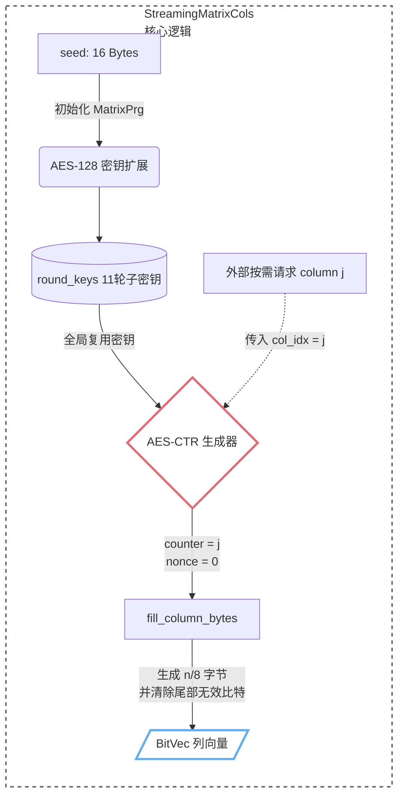

# 模块一：底层数学与流式矩阵

有限域表示、比特向量与大矩阵流式计算

## 一、概述

本模块为上层关系证明提供有限域和二元矩阵操作。它解决两个根本问题：
1. 如何在 $\mathbb{F}\_{2^{128}}$ 上表示和计算关系证明所需的域元素；
2. 基于编码的 ZK 协议需要大量的随机矩阵（如 $B \in \mathbb{F}\_2^{n \times m}$），如何快速操作 $\mathbb{F}\_2^{n \times m}$（$n \approx 10^4, m \approx 10^5$）量级的二元矩阵，同时增大 cache 命中率。

## 二、GF(2^128) 有限域运算：`finite_field.rs`

### 2.1 数学背景

$\text{GF}(2^{128})$ 是特征为 2 的扩域，域元素是次数小于 128 的二元多项式：

$$
a(x) = a_{127}x^{127} + a_{126}x^{126} + \cdots + a_1x + a_0, \quad a_i \in \mathbb{F}\_2
$$

加法即按位 XOR；乘法是多项式乘法再模实现所选的 128 次不可约多项式。具体表示由 `swanky_field` 的 `F128b` 实现决定。

### 2.2 代码实现方式

| 数学概念 | 代码中对应 | 说明 |
|---------|-----------|------|
| $\mathbb{F}\_{2^{128}}$ 元素 | `F128b` (来自 `swanky-field-binary`) | 128-bit 有限域元素的封装 |
| 域加法 $a + b$ | `a + b` | 特征 2 域上的加法；具体机器指令由编译器决定 |
| 域乘法 $a \cdot b$ | `a * b` | 由 `swanky-field-binary` 提供；可用时可走硬件加速路径 |
| 零元 | `F128b::ZERO` | $a + 0 = a$ |
| 单位元 | `F128b::ONE` | $a \cdot 1 = a$ |

代码没有自己实现域运算，而是复用 `swanky` 的有限域接口。支持的硬件路径由编译特性和目标架构决定：

x86_64 下使用 `PCLMULQDQ` 指令 + AES-NI 的 `AESDEC` 做多项式约简，单条指令在一个时钟周期内完成 64-bit 无进位乘法，约简阶段复用 AES 轮函数加速。

`benches/gf128_bench.rs` 用于测量域乘法；具体耗时随 CPU、编译参数和线程环境变化。

### 2.3 安全注意事项

有限域函数的实现路径避免了显式的秘密相关分支；侧信道特性还与编译器、硬件、调用上下文和整个协议有关。

## 三、大矩阵流式计算：`streaming_matrix.rs`

### 3.1 问题与设计思想

在基于编码的 ZK 协议中（AFS 哈希和相关线性关系），需要使用伪随机矩阵。以 RingSig/GroupSig/FDABS 的单个哈希矩阵为例：

$$
B \in \mathbb{F}\_2^{n \times m}, \quad n = 1280,\ m = (1280/8)\cdot 2^8 = 40960
$$

若直接物化，该单个矩阵约为 $1280 \times 40960\text{ bits}=6.25\text{ MiB}$（不计容器开销）。对于单张矩阵尚且可控，但协议运行中会生成许多张这样的矩阵，加上中间变量的暂存，一方面会增大内存的占用，另一方面会降低 cache 的命中率。但是VOLE 树的叶子承诺需要用到种子衍生的矩阵只在求值时用一次，无需常驻内存。

本实现采用列式伪随机流式生成，不存储整个矩阵，而是存储一个 128-bit 种子，在需要某一列时即时计算。

### 3.2 核心数据结构与公式-代码映射

| 数学符号 | 代码对应 | 说明 |
|---------|---------|------|
| $B \in \mathbb{F}\_2^{n \times m}$ | `StreamingMatrixCols` | 不存储矩阵本身，仅持有种子和维度信息 |
| 种子 $\sigma$ | `seed: [u8; 16]` | 128-bit PRG 种子，用于确定性扩展 |
| 行数 $n$ | `rows: usize` | 矩阵行数 |
| 列数 $m$ | `cols: usize` | 矩阵列数 |
| $B_{:,j}$（第 $j$ 列） | `column(j) -> BitVec` | 按需生成第 $j$ 列 |
| PRG 展开轮密钥 | `round_keys: [[u8;16]; 11]` | AES-128 密钥扩展后的 11 轮子密钥 |

### 3.3 核心流程图




### 3.4 内存管理策略详解

#### 策略一：按需生成，不存储完整矩阵

矩阵默认不完整存储在内存中。`StreamingMatrixCols` 保存 16 字节种子、维度、尾部掩码和 PRG 状态；每次调用 `column(j)` 生成一列的 $n$ 个比特，完成计算后释放临时列数据。因此主要工作空间从物化矩阵的 $\mathcal{O}(nm)$ 降为一列缓冲区和 PRG 状态，具体字节数随所选实现路径而变。

#### 策略二：延迟生成

`fill_column_bytes` 使用按需填充模式。只有 `column(j)` 或 `fill_column_bytes` 被显式调用时，数据才被生成。`materialize()` 方法提供全矩阵物化接口用于测试；正式实验通过 `iter()` 依次生成并处理矩阵列。

#### 策略三：AES-CTR 作为向量 PRG

每一列 $B_{:,j}$ 通过 AES-128 在 CTR 模式下生成：

$$
B_{:,j} = \text{AES}\_\sigma(\text{ctr}=j || \text{nonce}=0) \; \| \; \text{AES}\_\sigma(\text{ctr}=j || \text{nonce}=1) \; \| \; \cdots
$$

其中 $\sigma$ 是 16 字节种子。每个 AES 块产生 128 位伪随机输出，因此生成 $n$ 位列向量需要 $\lceil n/128 \rceil$ 次 AES 加密调用。

关键优化细节：
- 密钥扩展一次：`expand_key` 在构造 `MatrixPrg` 时把种子扩展为 11 轮子密钥，后续 `fill_column_bytes` 的每次 AES 加密都复用这些轮密钥，避免重复扩展。
- AES 路径：满足编译条件时，`aes128_ctr::fill` 使用 `_mm_aesenc_si128` / `_mm_aesenclast_si128` 处理连续块，并以列索引作为 PRG 的 tweak。其字节级输出由与 FAEST PRG 的回归测试校验。
- 尾部掩码清除：因 $n$ 可能不是 8 的倍数，最后一字节的高位可能包含无效比特。`clear_column_tail_bits` 用 `tail_mask` 清除这些位，保证列向量的有效性。

## 四、稀疏矩阵-向量乘法：`bitvec_ops.rs`

### 4.1 问题

在基于编码的 ZK 中，$y=B\cdot\operatorname{RE}(x)$ 的输入是正则编码词。若原始输入长度为 $n$、分块大小为 $c$，则 $\operatorname{RE}(x)$ 恰有 $n/c$ 个 1；因此矩阵乘法可退化为只累加被选中的列：

$$
y_i = \bigoplus_{j: x_j = 1} B_{i,j}
$$

### 4.2 公式-代码映射

| 数学概念 | 代码中对应 |
|---------|-----------|
| $B_{n \times m}$ | `matrix_b: &[BitVec<u8, Msb0>]` 行优先 MSB 存储 |
| $x$ 中为 1 的索引集合 $\{j \mid x_j = 1\}$ | `x_indices: &[usize]` |
| $y_i = \bigoplus_{j: x_j=1} B_{i,j}$ | 对每个 `col_idx`，遍历所有行，异或对应比特 |
| $\mathbb{F}\_2$ 加法（XOR） | `result.set(row, !current)` |

### 4.3 算法伪代码

```
Algorithm: Matrix-Vector Multiply (Sparse)
Input:  matrix_b (rows × cols, row-major BitVec)
        x_indices (sorted list of indices where x_j = 1)
Output: result (len = rows, BitVec)

for each col_idx in x_indices:
    byte_pos  ← col_idx / 8           // 列所在字节位置
    bit_in_byte ← 7 - (col_idx % 8)   // Msb0 下比特在字节中的偏移
    mask ← 1 << bit_in_byte
    
    for row in 0..rows:
        if matrix_b[row].bytes[byte_pos] & mask != 0:
            result[row] ← NOT result[row]   // 即 XOR 1
```

### 4.4 缓存优化分析

该算法利用了矩阵的行主序存储 `Vec<BitVec<u8, Msb0>>` 与稀疏索引遍历的结合：

1. 空间局部性：对于同一个 `col_idx`，连续访问 `matrix_b[0..rows]` 的同一字节位置 `byte_pos`，这些字节在内存中紧密排列（每行相邻），因此 CPU 缓存命中率极高。
2. 稀疏矩阵的计算优势：若汉明重量 $w = 320$ 而列数 $m = 81920$，则避免了 $81920 - 320 \approx 81600$ 次全列扫描，加速比达到 $\mathcal{O}(m/w)$。
3. 字节级寻址：通过预计算 `byte_pos` 和位掩码，避免了逐位索引的间接开销。

从测试代码 `test_matrix_vector_multiply_report` 的配置（1280 行 × 81920 列，汉明重量 320）看，平均一次乘法在数十毫秒量级（具体取决于 CPU 频率和缓存大小），这为上层协议的高效运行奠定了基础。

### 4.5 重要澄清：三种矩阵乘法模式

本系统中存在三种不同的矩阵乘法实现，用于不同场景：

| 模式 | 实现位置 | 存储方式 | 矩阵来源 | 使用场景 |
|------|---------|---------|---------|---------|
| 行主序物化乘法 | `bitvec_ops.rs` `matrix_vector_multiply_sparse` | 行主序 `Vec<BitVec>` | 已完全物化到内存 | 参考/测试中的小矩阵、单步调试验证 |
| 列流式 XOR 乘法（非 CT） | `afs_hash.rs` `afs_hash_streaming` / `linear_matrix_vector_mul_streaming` | 按需生成列 | `StreamingMatrixCols` 流式生成 | 生产代码中公开输入的哈希/矩阵-向量乘 |
| 列流式 XOR 乘法（CT） | `afs_hash.rs` `afs_hash_streaming_ct` / `linear_matrix_vector_mul_streaming_ct` | 按需生成全部列 + 掩码 | `StreamingMatrixCols` 流式生成 | 生产代码中秘密输入（Witness） 的常数时间求值 |

重要区别：

`bitvec_ops.rs` 中的 `matrix_vector_multiply_sparse` 是行主序的——矩阵 $B$ 完全物化，通过行内列跨步访问实现稀疏乘法。它主要用于单元测试和参考实现，验证 $y = Bx$ 的正确性。

非 CT 列流式（`afs_hash_streaming`、`linear_matrix_vector_mul_streaming`）：仅生成 $x$ 中为 1 的索引对应的列，进行 XOR 累加。输入 $x$ 必须为公开值，否则会侧信道泄露。

```rust
// fs_hash_streaming: 非 CT, 仅遍历 x 中为 1 的 chunk
for (chunk_idx, chunk) in x.chunks(c).enumerate() {
    let col_idx = chunk_idx * domain_size + bits_to_index_be(chunk);
    b_cols.fill_column_bytes_prechecked(col_idx, &mut column_bytes);
    xor_assign_bytes(acc_bytes, &column_bytes);
}
```

CT 列流式（`afs_hash_streaming_ct`、`linear_matrix_vector_mul_streaming_ct`）：对每个 chunk 的所有 $2^c$ 列都进行流式生成，但使用恒定时间掩码决定是否 XOR。内存访问模式和数据流均与秘密输入 $x$ 无关：

```rust
// afs_hash_streaming_ct: 常数时间, 扫描所有 domain_size 列
for table_idx in 0..domain_size {
    b_cols.fill_column_bytes_prechecked(column_start + table_idx, &mut column);
    let mask = 0u8.wrapping_sub(ct_eq_usize(table_idx, one_hot_idx).unwrap_u8());
    masked_xor_assign_bytes(&mut output, &column, mask);
}
```

这三种模式互不矛盾——它们服务于不同的工程目的：行主序用于验证正确性，非 CT 列流式用于公开输入的快速求值，CT 列流式用于秘密输入的侧信道防御。

## 五、工程化保障机制

### 5.1 确定性验证

```rust
// streaming_matrix.rs 测试
fn test_streaming_matrix_is_deterministic() {
    let seed = [0x42u8; 16];
    let matrix = StreamingMatrixCols::new(seed, 19, 5);
    assert_eq!(matrix.column(0), matrix.column(0));       // 同种子同列
    assert_eq!(matrix.materialize(), matrix.materialize()); // 全矩阵确定性
}
```

确保 PRG 展开是确定性的——这是 ZK 协议中 Prover 和 Verifier 能对同一矩阵进行独立推导的基础。

### 5.2 FFI 兼容性验证

```rust
fn test_streaming_matrix_prg_matches_faest() {
    // 对多种种子、tweak 和输出长度，比较 Rust AES-CTR 与 C PRG 输出
    // 确保硬件加速路径与 FAEST 回退路径结果一致
}
```

保证行为等价：无论底层使用 AES-NI 还是 FAEST-FFI，PRG 输出必须逐字节一致。

### 5.3 域公理验证

`test_gf128_axioms` 验证了加法交换律、结合律、分配律以及恒等元，确认代码类型 `F128b` 所实现的 $\mathbb F_{2^{128}}$ 运算满足这些域公理。

## 六、性能总结

| 操作 | 实现方式 | 性能特征 |
|------|---------|---------|
| $\mathbb{F}\_{2^{128}}$ 乘法 | CLMUL/PMULL 硬件指令 | ~0.5 ms / 万次（实测） |
| 矩阵列生成（$n=1280$） | AES-CTR, 约 10 个 AES 块 | < 1 μs / 列 |
| $y = Bx$ 稀疏乘法（$w=320$） | 字节级 XOR 累加 | < 50 ms / 次 |
| 矩阵全物化 | 从不发生 | 内存占用从 12.5 MB → 32 字节 |

这三个底层文件（`finite_field.rs`, `bitvec_ops.rs`, `streaming_matrix.rs`）共同提供了域运算、参考矩阵乘法和流式矩阵展开。端到端性能与内存结果应使用模块十所述脚本、metadata 和原始样本报告。
