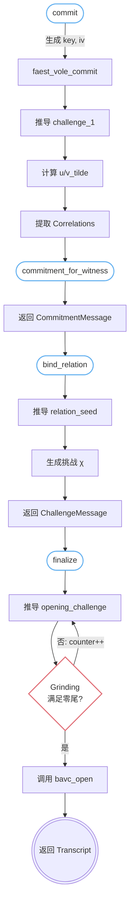
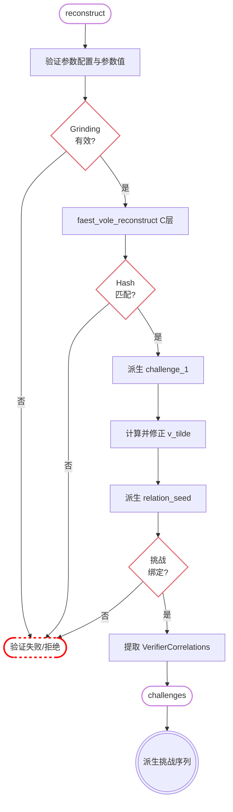
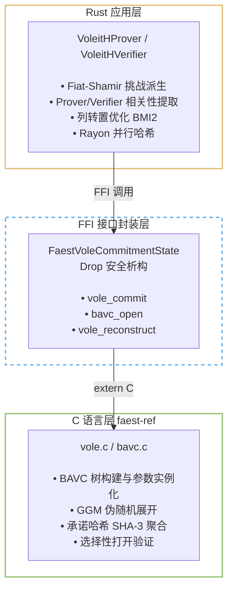

# 模块三：VOLEitH 状态机与跨语言 FFI

## 一、概述

本模块是整个 ZKP 系统的核心引擎——它负责将密码学约束系统与底层的延迟 VOLE 功能（Delayed VOLE functionality, $\mathcal{F}\_{\text{sVOLE}}$）衔接起来。架构上采用两层级联设计：

1. C 层（FAEST）：提供 GGM/BAVC 所需的承诺、打开和重构例程。$\tau$ 是并行重复数，$\lambda$ 是安全参数；树的形状由 FAEST 参数配置中的树参数确定。
2. Rust 层：通过 FFI 安全封装 C 层状态机，并在此基础上实现 Prover/Verifier 的协议状态机，负责挑战生成、相关性提取（correlation extraction）、约束绑定等高层协议逻辑。

## 二、为什么需要 FFI 复用 FAEST 的 C 代码？

### 2.1 GGM 树形向量承诺（BAVC）的密码学角色

在 VOLE-in-the-Head 范式中，Prover 需要承诺 $\tau$ 个伪随机种子 $K_1, \dots, K_\tau$，然后对每个种子应用 GGM 伪随机函数树（Goldreich-Goldwasser-Micali 树）展开。树的层数和叶子数由 FAEST 参数确定，这些叶子形成 VOLE 关系中 Prover 的秘密向量：

$$
\{(u_i, v_i)\}\_{i=1}^\tau \xrightarrow{\text{GGM 展开}} \{(u, \mathbf{v})\} \in \mathbb{F}\_2^\ell \times \mathbb{F}\_{2^{128}}^\ell
$$

BAVC（Binary Auxiliary Vector Commitment）是 FAEST 使用的一种优化的 GGM 树承诺方案，它支持：
- 批量承诺：一次承诺 $\tau$ 棵树的所有根密钥
- 选择性打开：根据 Verifier 挑战，仅打开挑战指定的叶子路径
- 一致性验证：Verifier 可通过承诺哈希验证打开的叶子是否正确

### 2.2 不复用的代价

如果完全用 Rust 重新实现 BAVC：
- 需要重新实现 $\tau$ 棵 GGM 树的构建、密钥扩展、Merkle 哈希聚合——这是数千行经过审计的 C 代码
- 需要保证与 FAEST 规范的行为完全一致（包括常数时间执行、字节序、SHA-3 用法等）
- 复用参考实现可保持 BAVC 的字节级行为一致；参数、协议组合和本地关系证明由本项目的实现与论文共同定义。

### 2.3 代码组织

```
faest-ref/           ← C 源码（子模块）
  ├── vole.c         ← 核心 VOLE 展开逻辑
  ├── bavc.c/h       ← BAVC 树承诺实现
  └── instances.c/h  ← 参数实例化

src/
  ├── faest_abi.c     ← C 侧 ABI 验证辅助函数
  ├── faest_ffi.rs    ← Rust 侧 FFI 绑定 + Rust 复用的 VOLE 哈希
  ├── core/voleith.rs ← 高层 Prover/Verifier 状态机
  └── core/wire.rs    ← 序列化/反序列化
```

## 三、FFI 绑定的安全封装：`faest_ffi.rs`

### 3.1 C 侧数据结构的内存布局对齐

`faest_ffi.rs` 使用 `#[repr(C)]` 精确复刻了 C 侧的两个核心结构体：

`FaestParamset` — FAEST 参数集（对应 C 的 `faest_paramset_t`）

| Rust 字段 | C 偏移 | 含义 |
|-----------|--------|------|
| `lambda` | `offset 0` | 安全参数（128/192/256） |
| `tau` | `offset 2` | 平行 GGM 树数量（16 / 10） |
| `w_grind` | `offset 3` | Grinding 安全比特数 |
| `t_open` | `offset 4` | 打开的树数量 |
| `k` | `offset 8` | 树深度参数 |
| `tau0, tau1` | `offset 9-10` | 不同深度树的数量 |
| `big_l` | `offset 11` | 叶子总数 |

`Bavc` — BAVC 承诺状态（对应 C 的 `bavc_t`）

```rust
#[repr(C)]
struct Bavc {
    h: *mut u8,    // 承诺哈希指针
    k: *mut u8,    // 打开密钥指针
    com: *mut u8,  // 承诺值指针
    sd: *mut u8,   // 种子指针
}
```

ABI 一致性验证：`test_rust_c_ffi_layouts_match_exactly` 测试通过调用 C 侧的 `cbzk_faest_paramset_layout` 和 `cbzk_bavc_layout` 获取 C 编译器的 `sizeof`、`alignof` 和 `offsetof`，与 Rust 侧的 `size_of`、`align_of`、`offset_of!` 精确比对。若 ABI 在未来的 faest-ref 版本中有变化，该测试会立即失败。

### 3.2 外部函数接口声明

```rust
extern "C" {
    fn vole_commit(
        root_key: *const u8,     // τ 个种子密钥
        iv: *const u8,           // 初始化向量
        ell_hat: c_uint,         // 扩展关系长度
        params: *const FaestParamset,
        bavc: *mut Bavc,         // [输出] BAVC 状态
        c: *mut u8,              // [输出] 一致性承诺
        u: *mut u8,              // [输出] VOLE 的 u 向量
        v: *mut *mut u8,         // [输出] VOLE 的 v 矩阵（行指针数组）
    );

    fn bavc_open(
        decom_i: *mut u8,        // [输出] 打开数据
        bavc: *const Bavc,       // BAVC 状态
        decoded_challenge: *const u16, // 解码后的挑战
        params: *const FaestParamset,
    ) -> bool;                   // 成功/失败

    fn vole_reconstruct(
        commitment_hash: *mut u8,
        q: *mut *mut u8,
        iv: *const u8,
        challenge: *const u8,
        opening: *const u8,
        c: *const u8,
        ell_hat: c_uint,
        params: *const FaestParamset,
    ) -> bool;

    fn decode_all_chall_3(
        decoded_challenge: *mut u16,
        challenge: *const u8,
        params: *const FaestParamset,
    ) -> bool;
    // ...
}
```

这些函数构成了 Prover 和 Verifier 与 C 层的完整接口契约。

### 3.3 Rust 侧的安全封装层

#### 3.3.1 生命周期管理：`FaestVoleCommitmentState` + `Drop`

```rust
pub struct FaestVoleCommitmentState {
    bavc: Bavc,               // 裸 C 结构体（含裸指针）
    params: Box<FaestParamset>, // 堆分配的参数集
}

impl Drop for FaestVoleCommitmentState {
    fn drop(&mut self) {
        if /* 任一指针非空 */ {
            unsafe { bavc_clear(&mut self.bavc); }
            // 清空所有指针
        }
    }
}
```

- `params` 使用 `Box<FaestParamset>` 堆分配，确保 `vole_commit` 写入时指针稳定性
- `Drop` trait 在对象销毁时调用 `bavc_clear` 释放 C 侧堆内存
- 双重 null 检查防止重复释放

#### 3.3.2 行指针数组的拼接

`vole_commit` 要求 `v` 参数为一个 `*mut *mut u8`（指向指针数组的指针），每个指针指向 VOLE 的 $\lambda$ 行中的一行。Rust 侧构建方式：

```rust
let mut v_rows = vec![0u8; public_params.lambda_bits * row_bytes];
let mut row_ptrs = (0..public_params.lambda_bits)
    .map(|row| unsafe { v_rows.as_mut_ptr().add(row * row_bytes) })
    .collect::<Vec<_>>();
```

C 函数写入 `v_rows` 后，Rust 侧通过 `row_ptrs` 重新解读为连续内存块中的 $\lambda$ 行 × `row_bytes` 列的矩阵。这样既满足了 C 接口的指针数组要求，又在 Rust 侧保持了连续内存的安全访问。

#### 3.3.3 错误传播与状态验证

每次外部函数调用后都进行状态验证：

```rust
// 检查 BAVC 状态是否完整
if bavc.h.is_null() || bavc.k.is_null() || bavc.com.is_null() || bavc.sd.is_null() {
    // 部分分配时清理，然后返回错误
    return Err("FAEST vole_commit returned an incomplete BAVC state".to_string());
}
```

这种防御式编程模式确保即使 C 侧返回异常状态，Rust 侧也不会在空指针上继续操作。

### 3.4 VOLE 哈希：同一算法的两种实现

FAEST C 的 `universal_hashing.c` 提供 `vole_hash_128`，仓库同时保留 Rust 等价实现 `vole_hash_128f_rust`。运行路径选用 Rust 版本：Rust 使用 `F128b` 和可用时的 PCLMULQDQ，C 的 `bf128_mul`/`bf64_mul` 使用逐 bit 的 shift-and-XOR 实现。

```rust
fn vole_hash_128f_rust(seed, input, hash_ell_bits) -> [u8; 18]
```

这实现了一个基于代码类型 `F128b`（对应 $\mathbb F_{2^{128}}$）运算的密钥哈希，核心计算为：

$$
H = (h_2, h_3) = (r_0 \cdot h_0 + r_1 \cdot h_1,\; r_2 \cdot h_0 + r_3 \cdot h_1)
$$

其中：
- $h_0$ 通过 Horner 法在 $\mathbb{F}\_{2^{128}}$ 上计算多项式求值
- $h_1$ 通过 Horner 法在 $\mathbb{F}\_{2^{64}}$ 上计算多项式求值（使用 `gf64_mul`）

`gf64_mul` 的双重加速策略：

| 路径 | 条件 | 实现 |
|------|------|------|
| 硬件加速 | x86_64 + PCLMULQDQ | `_mm_clmulepi64_si128` 一次完成 64×64→128 无进位乘法 |
| 可移植回退 | 其他平台 | 逐位 `shift-and-XOR` 软实现 |

硬件路径使用 PCLMULQDQ 指令完成 $\mathbb{F}\_{2^{64}}$ 上的无进位多项式乘法，约简通过经典的两步折叠（fold）算法实现：

```rust
let overflow = (high >> 63) ^ (high >> 61) ^ (high >> 60);
low ^ high ^ (high << 1) ^ (high << 3) ^ (high << 4)
    ^ overflow ^ (overflow << 1) ^ (overflow << 3) ^ (overflow << 4)
```

这约简多项式 $x^{64} + x^4 + x^3 + x + 1$。

`test_rust_vole_hash_matches_faest_c_reference` 在多种输入长度（0 ~ 28176 比特）和随机种子下，逐字节比对 Rust 实现与 C 参考实现的输出。该哈希步骤的端到端影响已计入模块十的签名和验证时间。

## 四、状态机设计：`voleith.rs`

### 4.1 延迟 VOLE 功能（Delayed VOLE）

在 VOLEitH 协议中，Prover 和 Verifier 需要建立以下 VOLE 关系：

$$
\text{Prover 持有: } (u, \mathbf{v}) \in \mathbb{F}\_2^\ell \times \mathbb{F}\_{2^{128}}^\ell
$$
$$
\text{Verifier 持有: } (\Delta, \mathbf{q}) \in \mathbb{F}\_{2^{128}} \times \mathbb{F}\_{2^{128}}^\ell
$$

满足线性关系：

$$
\mathbf{v} = \mathbf{q} + \Delta \cdot u
$$

其中 $\Delta$ 是 Verifier 的全局挑战，$u$ 是 Prover 的秘密比特向量，$\mathbf{v}, \mathbf{q}$ 是对应的 $\mathbb{F}\_{2^{128}}$ 域元素向量。

"延迟"的含义是：在协议初始阶段（承诺阶段），Prover 和 Verifier 仅交换承诺，等到协议运行到特定步骤后才确定 $\Delta$ 和挑战。

### 4.2 Prover 状态机：`VoleitHProver`




### 4.3 Verifier 状态机：`VoleitHVerifier`



### 4.4 核心数据结构

| 结构体 | 持有方 | 数学含义 |
|--------|--------|---------|
| `ProverCorrelations` | Prover | $(u, \mathbf{v})$ + 打包的辅助相关性 |
| `VerifierCorrelations` | Verifier | $(\Delta, \mathbf{q})$ + 打包的辅助相关性 |
| `VoleitHTranscript` | 公开传输 | 协议的全部通信轨迹：承诺哈希、IV、一致性承诺、哈希值、打开数据等 |

### 4.5 Fiat-Shamir 挑战派生序列

协议使用三个阶段的 Fiat-Shamir 派生将交互式协议转化为 NIZK：

第 1 轮挑战 `challenge_1`：源自 BAVC 承诺 + 一致性证明
```
absorb(profile, statement, witness_bits, degree, relation_bits,
       ell_hat_bits, commitment_hash, iv, consistency_c)
squeeze() → challenge_1
```

第 2 轮关系挑战 `relation_seed`：源自承诺哈希 + VOLE 哈希值 + 校正子
```
absorb(profile, statement, witness_bits, degree, relation_bits,
       ell_hat_bits, commitment_hash, iv, consistency_c,
       u_tilde, v_tilde[0..λ], correction)
squeeze() → relation_seed
```

第 3 轮打开挑战 `opening_challenge`：源自 relation_seed、证明系数和 grinding counter
```
absorb(relation_seed, proof.blinded_coeffs[0..d], counter)
squeeze() → opening_challenge
```
然后通过 Grinding（递增 counter 使挑战值的后 `w_grind` 位为零）增加协议的安全性。

### 4.6 Grinding 证明工作量

```rust
fn challenge_has_required_grind_bits(challenge, w_grind) -> bool {
    // 检查挑战值的后 w_grind 个比特是否全部为零
    ((λ - w_grind)..λ).all(|bit| !bit_lsb(challenge, bit))
}
```

这要求 Prover 在最终确定签名前，平均需要约 $2^{w_\text{grind}}$ 次尝试。对于当前 `w_grind = 8` 的参数配置，平均工作量约为 256 次。该工作量是 FAEST opening 规则的一部分；`security.rs` 将其作为单独的工作因子记录，不把它直接加到关系证明的统计 soundness bound 中。

## 五、序列化字节格式：`wire.rs`

### 5.1 版本化规范格式

`wire.rs` 实现了应用签名共享部分的自描述、版本化规范字节格式。各应用可在共享部分后追加自身的公开字段。

格式结构：

```
┌─────────┬──────────┬────────┬──────────┬──────────────┬──────┐
│  Magic  │ Version  │  Kind  │ Reserved │   Payload    │ Tail │
│  8 字节 │  2 字节  │ 1 字节 │  1 字节  │ 变长        │ 检查 │
└─────────┴──────────┴────────┴──────────┴──────────────┴──────┘
```

- 格式标识符：`CBZKVSIG`（8 字节，用于识别格式类型）
- Version：当前为 `1`（小端编码）
- Kind：签名类型标识

| 常量 | 值 | 含义 |
|------|-----|------|
| `KIND_RESOLVED_PLUS` | 1 | ReSolveD+ 签名 |
| `KIND_RING` | 2 | 环签名 |
| `KIND_GROUP` | 3 | 群签名 |
| `KIND_FDABS` | 4 | 全动态属性基签名 |
| `KIND_LINKABLE_RING` | 5 | Scope-LRS 签名 |
| `KIND_LINKABLE_RING_BATCH` | 6 | 批量 Scope-LRS 签名 |

### 5.2 序列化内容

共享部分包含三个主要部分：
1. `CommitmentMessage`：校正子（correction）比特向量
   - 编码方式：长度前缀（u64）+ 紧凑位编码（`extend_exact_bits_to_bytes`）
2. `ProofMessage<F128b>`：盲化系数向量（blinded coefficients）
   - 编码方式：长度前缀（u64）+ 每个系数 16 字节（`F128b::to_bytes()`）
3. `VoleitHTranscript`：完整的 VOLE 协议通信轨迹
   - 参数配置标识符（1 字节）
   - commitment_hash（32 字节）
   - IV（16 字节）
   - consistency_c（长度前缀 + 变长）
   - u_tilde（长度前缀 + 变长）
   - opening（长度前缀 + 变长）
   - challenge（16 字节）
   - grind_counter（4 字节）

### 5.3 解码验证

解码器 `SignatureDecoder` 保证：

1. 尾部零多余数据：`finish()` 检查 `offset == input.len()`，拒绝任何尾随字节
2. 唯一定义性：所有变长字段使用精确长度前缀，任何非规范编码（如尾部未使用比特非零）被拒绝
3. F128 值的固定宽度反序列化：使用 `F128b::from_bytes` 读取每个 16 字节域元素
4. 集合大小上限：`MAX_COLLECTION_ITEMS = 1,000,000` 防止拒绝服务攻击

## 六、跨语言调用架构总结



### 关键设计决策

| 决策 | 理由 |
|------|------|
| VOLE 哈希保留 Rust 等价实现 | C 版本可作参考校验，但其有限域乘法为逐 bit 实现；Rust 路径可利用 PCLMULQDQ/PMULL |
| BAVC 树承诺保留在 C 侧 | 复用 FAEST 参考实现的字节级承诺/打开行为，并由 Rust 包装层管理其资源 |
| 列转置在 Rust 侧执行 | 需要 Rust 的 `rayon` 并行框架；使用 BMI2 `PEXT` 指令优化逐位列提取 |
| Grinding 在 Rust 侧完成 | 不依赖 C 状态；当前实现逐个 counter 搜索满足参数配置要求的挑战 |
| 序列化手动编码 | 避免通用序列化框架的开销和版本漂移；精确的位紧凑编码 |
