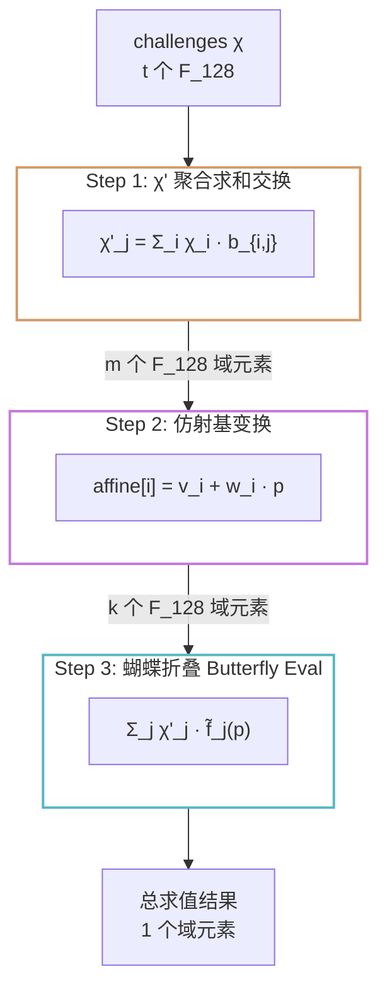

# 模块四：正则编码到多项式约束的转化——ANF 约束编译与蝴蝶隐式求值

## 一、概述

本模块是系统中最具理论创新性的部分。它解决的核心问题是：

> 如何将正则编码函数（Regular Encoding）——一个看似非线性的、基于查表的操作——转化为 degree-$c$ 的布尔多项式（ANF），然后在 ZK 协议的"隐式空间"中高效地安全求值？

这分为两个阶段：

1. `constraint_gen.rs` — 编译阶段：离线预计算正则编码的 ANF 系数表
2. `implicit_eval.rs` — 求值阶段：在线安全计算 χ-加权隐式多项式，使用蝴蝶折叠算法（Butterfly Evaluation）将复杂度从 $\mathcal{O}(m \cdot 2^c)$ 降至 $\mathcal{O}(m \cdot c)$

## 二、正则编码的代数化——从独热向量到 ANF 多项式

### 2.1 问题重述

正则编码将一个 $c$ 比特的输入 $X = (X_0, \dots, X_{c-1}) \in \mathbb{F}\_2^c$ 映射为 $2^c$ 比特的独热向量：

$$
\text{RE}(X) = (f_0(X), f_1(X), \dots, f_{2^c-1}(X)) \in \mathbb{F}\_2^{2^c}
$$

其中 $f_{\text{idx}}(X) = 1$ 当且仅当 $\text{idx} = \sum_{t=0}^{c-1} X_t \cdot 2^{c-1-t}$（大端序整数解释）。

### 2.2 封闭形式的布尔多项式

每个输出位 $f_{\text{idx}}(X)$ 可以写为一个标准的 ANF（代数正规型） 多项式。其构造基于拉格朗日插值思想：

对于索引 `idx`，其大端二进制表示为 $j_0 j_1 \dots j_{c-1}$。定义：

$$
f_{\text{idx}}(X_0, \dots, X_{c-1}) = \prod_{t=0}^{c-1} (j_t + X_t + 1) \pmod{2}
$$

解释：
- 当 $j_t = 1$（索引的该比特为 1）：因子为 $X_t$（要求 $X_t = 1$）
- 当 $j_t = 0$（索引的该比特为 0）：因子为 $1 + X_t$（要求 $X_t = 0$）

展开后得到一个 degree-$c$ 的 ANF 多项式——即布尔变量的乘积之和（XOR of ANDs），每个单项的度数 $\le c$。

示例（$c=3$, idx=5, 即二进制 `101`）：
$$
f_5(X_0, X_1, X_2) = X_0(1+X_1)X_2 = X_0X_2 + X_0X_1X_2
$$

这是一个度数为 3 的多项式，包含 2 个单项式。

### 2.3 编译方法：子集包含（Möbius 变换）

代码中的 `compile_re_constraints` 没有直接展开上述乘积形式，而是使用更优雅的子集包含条件：

```rust
for idx in 0..domain_size {
    let mut coeffs = bitvec![u8, Msb0; 0; domain_size];
    for u in 0..domain_size {
        if (idx & u) == idx {
            coeffs.set(u, true);
        }
    }
    table.push(coeffs);
}
```

| 数学概念 | 代码中对应 |
|---------|-----------|
| 输出索引 $\text{idx}$ | `idx: usize`（0 到 $2^c-1$） |
| 单项式索引 $u$（输入变量的子集指示器） | `u: usize` |
| 系数 $a_{\text{idx}, u} \in \mathbb{F}\_2$ | `coeffs[u]` |
| $f_{\text{idx}}(X) = \bigoplus_{u} a_{\text{idx}, u} \cdot X^u$ | `table[idx]` 的每一行 |
| 条件 $idx$&$u==idx$ | 子集包含关系 | 

为什么子集包含条件成立？

这是 Mobius 变换在布尔立方体上的应用。对于布尔函数 $f: \mathbb{F}\_2^c \to \mathbb{F}\_2$，其 ANF 系数由下式给出：

$$
a_u = \bigoplus_{x: \text{supp}(x) \subseteq u} f(x)
$$

对于独热函数 $f_{\text{idx}}$，仅在 $x = \text{idx}$ 时取 1。因此 $a_u = 1$ 当且仅当 $\text{supp}(\text{idx}) \subseteq u$，即 $\text{idx}$&$u = \text{idx}$。

例如对于 $c=3$, $\text{idx}=5$（二进制 `101`）：
- $u=5$（`101`）：`101 & 101 == 101` ✅ → 包含单项式 $X_0X_2$
- $u=7$（`111`）：`101 & 111 == 101` ✅ → 包含单项式 $X_0X_1X_2$
- $u=4$（`100`）：`101 & 100 != 101` ❌ → 不包含

### 2.4 系数表验证

`validate_re_constraints` 确保调用者提供的表与规范表一致。`fuzz_re_constraints_equivalence` 对 $c=8$ 的 1000 个随机输入验证了编译表求值与直接正则编码的一致性。

## 三、隐式求值引擎：`implicit_eval.rs`

### 3.1 为什么需要"隐式"求值？

完整的 ZK 协议需要 Prover 证明约束系统 $\{g_i(Y) = 0\}\_{i=1}^t$ 成立。如果不做优化，Prover 需要对 $t$ 个独立的约束多项式逐个求值、插值——这是 $\mathcal{O}(t \cdot 2^c)$ 的复杂度，对于 $t \approx 1280$、$c \approx 8 \sim 16$ 是不可接受的。

核心洞察：在协议中，Verifier 实际上只验证一个 χ-加权的总多项式：

$$
\tilde{G}(Y) = \sum_{i=1}^t \chi_i \cdot \tilde{g}\_i(Y)
$$

利用这个交换律，可以将求值复杂度从 $\mathcal{O}(t \cdot 2^c)$ 降低到 $\mathcal{O}(m \cdot c)$。

### 3.2 三步求值流水线



#### 步骤 1：χ' 聚合（求和交换）

对于约束系统 $g_i(Y) = \sum_j b_{i,j} f_j(Y) + y_i$，交换求和顺序：

$$
\sum\_{i=1}^t \chi\_i \cdot g\_i(Y) = \sum_{j=1}^m \underbrace{\left(\sum\_{i=1}^t \chi\_i \cdot b\_{i,j}\right)}\_{\chi'\_j} \cdot f\_j(Y) + \underbrace{\sum\_{i=1}^t \chi\_i \cdot y\_i}\_{\text{const\_term}}
$$

`compute_chi_prime` 的极简实现：

```rust
fn compute_chi_prime(challenges, b_cols) -> Vec<F> {
    for each column j:
        chi_prime[j] = sum_{i: b_cols[j][i]==1} challenges[i]
}
```

对于 $\mathbb{F}\_{2^{128}}$ 域，求和即 XOR。利用 `BitVec::iter_ones()` 快速扫描列为 1 的行索引。

`compute_chi_prime_streaming_f128` 的常数时间与流式优化实现：

对于流式矩阵（`StreamingMatrixCols`），关键在于预计算字节子集 XOR 表以避免逐位扫描：

```rust
fn build_byte_subset_xor_table(challenges, byte_len) -> Vec<[u128; 256]> {
    // 对每个字节位置 byte_idx：构建 256 条掩码对应的 128-bit XOR 结果
    for each byte_idx:
        for mask in 1..256:
            subset_table[mask] = subset_table[mask & (mask-1)] ^ challenge[bit]
}
```

这利用了 Gray 码 / DP 递推：`subset_table[mask]` 表示对挑战值集合 `challenge[byte_idx*8 + trailing_zeroes(mask)]` 的 XOR 累加。一旦预计算完成，任何列的求值退化为 $n/8$ 次查表 + XOR：

```rust
fn subset_xor_from_bytes(column_bytes, table, byte_len) -> u128 {
    // 对列字节的每个字节位置，直接查表累加
    for each byte in column_bytes:
        acc ^= table[byte_idx][byte as usize]
}
```

更进一步，代码对手工展开的 $160$ 字节场景（$n=1280$ 的典型字节长度）做了 SIMD 风格的手动循环展开（`xor_32!` 宏同时处理 32 个字节，每次迭代处理 5 块共 160 字节），将循环开销降至最低。

并行化：当列数 $\ge 8192$ 时，自动启用 `rayon` 并行，每 256 列为一个 chunk，每个 worker 拥有独立的 `column_bytes` 缓冲区。

#### 步骤 2：仿射基变换

将 witness 的每个比特 $w_i$ 和 VOLE 相关性 $v_i$ 组合成仿射基：

$$
\text{affine}\_i(p) = v_i + w_i \cdot p
$$

其中 $p$ 是当前的插值点。关键性质：
- 在 $p=0$ 时：$\text{affine}\_i(0) = v_i$（不泄漏 witness）
- 在 $p\neq 0$ 时：witness 通过乘以 $p$ 隐藏其中

这由 `implicit_evaluate_polynomials` 中的以下代码实现：

```rust
let affine_bases: Vec<F> = v.iter()
    .zip(w.iter().by_vals())
    .map(|(v_i, w_i)| *v_i + if w_i { point } else { F::ZERO })
    .collect();
```

#### 步骤 3：蝴蝶折叠（Butterfly Evaluation）

最核心的算法创新。

问题：对于每个大小为 $2^c$ 的分块，我们需要计算：

$$
\tilde{F}(p) = \sum_{j=0}^{\text{block\_count}-1} \sum_{\text{idx}=0}^{2^c-1} \chi'_{j, \text{idx}} \cdot \tilde{f}\_{\text{idx}}(p)
$$

其中 $\tilde{f}\_{\text{idx}}(p)$ 是正则编码多项式 $f_{\text{idx}}$ 在仿射基 $\text{affine}\_{j}$ 上的求值结果。直接展开需要 $\mathcal{O}(2^c)$ 次域乘法和加法。

蝴蝶算法将复杂度降至 $\mathcal{O}(c)$。它的灵感来自 FFT 的 Cooley-Tukey 蝶形结构：

```
Algorithm: evaluate_chunk_butterfly(chi_prime_chunk[0..2^c),
                                     x_vars[0..c), point)

输入：χ'_j 数组（2^c 个 F_{2^128} 元素）
      x_vars（c 个仿射基）
      point（插值点 p）
输出：求和结果（1 个 F_{2^128} 元素）

初始化 work[i] = chi_prime_chunk[i]   (i = 0..2^c)

// 第 0 层（对应最低有效位 LSB）
// x_vars[c-1] 是 x_0（因为 x_vars 是大端序）
x_0 ← x_vars[c-1]
for i in 0..2^{c-1}:
    work[i] = work[2i] · (p + x_0) ⊕ work[2i+1] · x_0

// 第 k 层（k = 1..c-1）
for k in 1..c:
    x_k ← x_vars[c-1-k]     // 反向索引：大端转小端
    for i in 0..2^{c-1-k}:
        work[i] = work[2i] · (p + x_k) ⊕ work[2i+1] · x_k

返回 work[0]     // 最后只剩一个元素
```

数学原理：

对于 $c=2$ 的可视化示例：

```
        层 0 (LSB: x_0)          层 1 (x_1)
                                      
χ'_0 ──┐                           ──┐
       × (p+x_0)                    × (p+x_1)
χ'_1 ──┘ ──┐                      ──┘
           × (p+x_1)  ── work[0] 
χ'_2 ──┐   × x_1
       × x_0  ── work[1]
χ'_3 ──┘

work[0] = (χ'_0(p+x_0) ⊕ χ'_1 x_0)(p+x_1) ⊕ (χ'_2(p+x_0) ⊕ χ'_3 x_0) x_1
         = χ'_0(p+x_0)(p+x_1) ⊕ χ'_1 x_0(p+x_1) ⊕ χ'_2(p+x_0) x_1 ⊕ χ'_3 x_0 x_1
         = Σ_{idx=0}^{3} χ'_{idx} · f_idx(x_0, x_1)
```

这精确地计算了 χ-加权的正则编码多项式在点 $(x_0, x_1)$ 的求值。

为什么按 LSB→MSB 顺序？ 代码的注释解释了原因：

> Butterfly 从 LSB 到 MSB 处理（与 `(2*i, 2*i+1)` 配对一致），因此遍历 `x_vars` 时需要反向：`x_vars[c-1-k]` 即对应 LSB 优先顺序。

这确保了 `monomial_from_table_index(table_idx, block_start, c)` 中的大端序变量索引与蝴蝶配对的正确对齐。

栈优化：当 $2^c \le 256$ 时，使用栈分配的定长数组`[F; 256]` 代替堆分配的 `Vec`，避免热路径上的内存分配。

#### 完整流水线集成

`implicit_evaluate_polynomials` 函数组合了上述三个步骤：

```rust
pub fn implicit_evaluate_polynomials<F>(
    chi_prime: &[F],    // 步骤 1 输出
    const_term: F,       // Σ χ_i · y_i
    v: &[F],             // VOLE V 组件
    w: &MainBitSlice,    // witness 比特
    c: usize,            // 块大小
    point: F,            // 插值点
) -> F {
    // 步骤 2: 构建仿射基
    let affine_bases = v.iter()
        .zip(w.iter().by_vals())
        .map(|(v_i, w_i)| v_i + if w_i { point } else { F::ZERO })
        .collect();
    
    // 步骤 3: 蝴蝶折叠 + 常数项补偿
    evaluate_chunk_sum_from_affine(chi_prime, &affine_bases, c, point)
        + const_term * point.pow(c)
}
```

### 3.3 双矩阵配对蝴蝶求值（环签名/群签名场景）

对于需要同时处理 $B_0$ 和 $B_1$ 两个矩阵的 Merkle 哈希约束（环签名），代码实现了配对蝴蝶求值：

- `implicit_evaluate_pair_direct_from_affine_no_const`：计算两个独立矩阵的 χ-加权和
- `implicit_evaluate_pair_swapped_from_affine_no_const`：计算交叉交换后的两个分量——这是 Merkle 路径方向比特约束的关键

在 `evaluate_pair_swapped_chunk_butterfly_reuse_slice` 中，左右两个仿射基 $(x_0^{\text{left}}, x_0^{\text{right}})$ 在第一层就分为四个工作缓冲区（direct left, swapped left, direct right, swapped right），后续层次分别用基向量做折叠。最终返回 $(\text{direct}, \text{swapped})$ 两个结果。

### 3.4 完整协议中的集成

`protocol_dd_rep.rs` 中的 `ProverRef::respond_resolved_plus_implicit` 方法完整地展示了如何使用隐式求值引擎：

```
Algorithm: Prover.respond_resolved_plus_implicit
Input: challenge (χ[0..t]), chi_prime, const_term, c

1. 选择 c+1 个插值点 p_0, ..., p_c (如 0..c)
2. 对每个插值点 p_k:
    2a. 构建仿射基 affine[i] = v[i] + witness[i] · p_k
    2b. 蝴蝶折叠求值 → value_k
3. 在 c+1 个点上插值，恢复出 c 次多项式的系数
4. 加上辅助 VOLE 的线性因子乘积（masking）
5. 返回盲化系数
```

### 3.5 性能优化汇总

| 优化技术 | 位置 | 加速比（相对朴素实现） |
|---------|------|---------------------|
| 求和交换（χ' 聚合） | `compute_chi_prime` | $\mathcal{O}(t \cdot m) \to \mathcal{O}(m)$ |
| 字节子集 XOR 表 | `build_byte_subset_xor_table` | $8\times$ 逐位扫描 |
| 手工 160 字节展开 | `xor_32!` / `subset_xor_from_bytes` | $2\sim 3\times$ 循环 |
| 栈分配工作缓冲区 | `evaluate_chunk_butterfly`（$2^c \le 256$） | 消除堆分配 |
| Rayon 并行 | 列 $\ge 8192$，块 $\ge 128$ | 接近核心数线性加速 |
| 配对蝴蝶同时求值 | `evaluate_pair_*_butterfly` | $2\times$（合并左右矩阵） |

## 四、公式-代码映射总结

| 数学概念 | 代码函数/变量 |
|---------|-------------|
| ANF 系数表 $a_{\text{idx}, u}$ | `compile_re_constraints(c) -> Vec<MainBitVec>` |
| 子集包含条件 $(idx \& u) == idx$ | `coeffs.set(u, (idx & u) == idx)` |
| 独热函数 $f_{\text{idx}}$ | `table[idx]`（ANF 系数行） |
| 聚合系数 $\chi'_j = \sum_i \chi_i b_{i,j}$ | `compute_chi_prime(challenges, b_cols)` |
| 流式 χ' 聚合 | `compute_chi_prime_streaming_f128(challenges, b_cols)` |
| 字节子集 XOR 查找表 | `build_byte_subset_xor_table` |
| 仿射基 $x_i = v_i + w_i \cdot p$ | `affine_bases[i] = v[i] + witness[i] * point` |
| 蝴蝶折叠求值 | `evaluate_chunk_butterfly(chi_prime_chunk, x_vars, point)` |
| 配对蝴蝶（双矩阵） | `evaluate_pair_*_chunk_butterfly_reuse_slice` |
| 隐式多项式求值器 | `implicit_evaluate_polynomials(chi_prime, const_term, v, w, c, point)` |
| 常數项 $\sum_i \chi_i y_i$ | `const_term` |
| 最终响应（盲化系数） | `ProverRef::respond_resolved_plus_implicit` |
