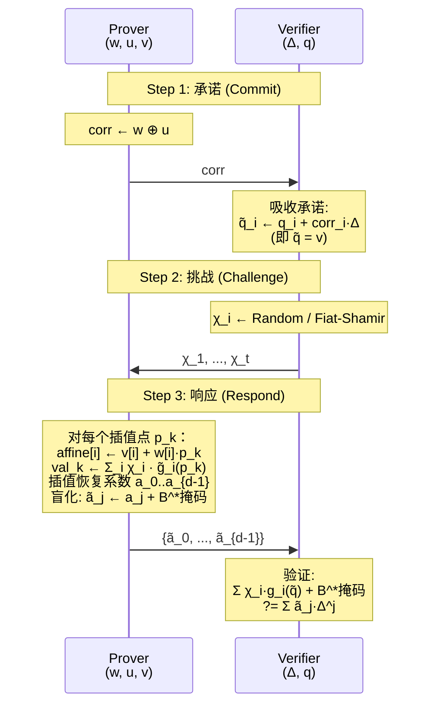
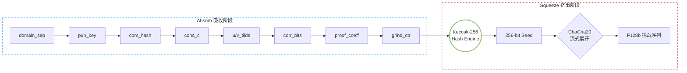

# 模块五：$\Pi^t_{dD-Rep}$ 核心协议与 NIZK 变换

---

## 一、概述

$\Pi^t_{dD-Rep}$（degree-$d$ Representation）协议是整个 ZK 系统的核心。它解决的核心问题是：

> 给定一个由 $t$ 个 degree-$d$ 布尔多项式组成的约束系统 $\{g_i(X) = 0\}_{i=1}^t$，Prover 如何在不泄露 witness $w \in \mathbb{F}_2^k$ 的前提下，让 Verifier 确信 $w$ 满足所有约束？

本模块包含两个层面：
1. `protocol_dd_rep.rs` — $\Pi^t_{dD-Rep}$ 协议的三步实现（承诺 → 挑战 → 响应/验证）
2. `transcript.rs` — Fiat-Shamir 变换的 Random Oracle 实例化（SHA-3 Keccak-256）

---

## 二、$\Pi^t_{dD-Rep}$ 协议三步曲

### 2.1 协议概览

$\Pi^t_{dD-Rep}$ 建立在 VOLE 相关性之上。回顾 Prover 和 Verifier 通过延迟 VOLE 功能 $\mathcal{F}_{\text{sVOLE}}$ 建立的关系：

$$
\begin{aligned}
\text{Prover: } &(u, \mathbf{v}) \in \mathbb{F}_2^k \times \mathbb{F}_{2^{128}}^k \\
\text{Verifier: } &(\Delta, \mathbf{q}) \in \mathbb{F}_{2^{128}} \times \mathbb{F}_{2^{128}}^k
\end{aligned}
$$

满足 $\mathbf{v} = \mathbf{q} + \Delta \cdot u$。Prover 拥有 witness $w \in \mathbb{F}_2^k$，公开约束系统为 $\{g_i(X)\}_{i=1}^t$。



### 2.2 Step 1：Witness 承诺（`commit`）

代数动机：Prover 不能直接发送 $w$（会泄露 witness），也不能发送 $u$（Verifier 已通过 $\mathcal{F}_{\text{sVOLE}}$ 部分知道 $u$）。解决方案是发送校正子（correction）：

$$
\text{corr} = w \oplus u \in \mathbb{F}_2^k
$$

```rust
pub fn commit(&self) -> CommitmentMessage {
    let correction_bytes = self.witness.as_raw_slice()
        .iter().copied()
        .zip(self.u.as_raw_slice().iter().copied())
        .take(byte_len)
        .map(|(witness, u)| witness ^ u)
        .collect();
    CommitmentMessage { correction }
}
```

校正子的信息论安全性：由于 $u$ 是 Prover 私有的秘密向量（Verifier 只知道 $q$ 和 $\Delta$，但 $u$ 对 Verifier 具有 $-\log_2(\text{Pr}[u=0]) = k$ 比特的熵），$w \oplus u$ 完美隐藏了 $w$。

Verifier 端的吸收：Verifier 利用校正子修正自己的 $q$：

$$
\tilde{q}_i = q_i + \text{corr}_i \cdot \Delta \in \mathbb{F}_{2^{128}}
$$

由于 $\mathbf{v} = \mathbf{q} + \Delta \cdot u$，且 $\text{corr} = w \oplus u$，验证：

$$
\tilde{q}_i = q_i + (w_i \oplus u_i) \cdot \Delta
$$

当 $w_i = u_i$ 时，$\text{corr}_i = 0$，$\tilde{q}_i = q_i = v_i$
当 $w_i \neq u_i$ 时，$\text{corr}_i = 1$，$\tilde{q}_i = q_i + \Delta = v_i$

因此 $\tilde{q} = \mathbf{v}$ 当且仅当校正子正确。Verifier 在不知道 $u$ 和 $v$ 的情况下，获得了正确 witness 所对应的 VOLE 关系。

常数时间实现：`corrected_q_from_bitvec` 使用 `conditional_select`（来自 `subtle` crate）逐字节展开校正子位，避免秘密依赖的分支。

### 2.3 Step 2：挑战生成（`ChallengeMessage`）

在交互式版本中，Verifier 采样随机域元素：

```rust
pub fn sample_challenges<R: Rng + ?Sized>(&self, rng: &mut R, count: usize) -> ChallengeMessage<F> {
    ChallengeMessage { challenges: (0..count).map(|_| F::random(rng)).collect() }
}
```

在 NIZK 版本中（参见下文第四章），挑战通过 Fiat-Shamir 变换从 transcript 中派生：

```rust
// 在 VoleitHProver::bind_relation 中
let seed = derive_relation_seed(...);
ChallengeMessage { challenges: f128_challenges_from_seed(seed, challenge_count) }
```

### 2.4 Step 3：Prover 响应（`respond` / `respond_resolved_plus_implicit`）

Prover 面对的核心任务是：计算 $\tilde{G}(Y) = \sum_{i=1}^t \chi_i \cdot \tilde{g}_i(Y)$ 在 $c+1$ 个插值点上的值，然后插值恢复多项式系数，最后用辅助 VOLE 进行盲化。

代码提供三种响应模式：

#### 模式 A：通用 ANF 求值（`respond`）

直接对约束系统 $\{g_i\}$ 的每个多项式在每个插值点逐项求值：

```
Algorithm: respond(system, challenge)
1. 选择 degree+1 个插值点 p_0, ..., p_d
2. 预计算 point_powers[p][k] = p^k
3. 预计算 affine_bases[p][i] = v[i] + w[i]·p
4. 并行：
   对每个 χ_i 和对应的多项式 g_i:
       对每个插值点 p:
           计算 g_i 在仿射基下的值 × point_powers[d - degree]
       → 得到 d+1 个求值结果
       拉格朗日插值 → d 个系数
       每个系数 × χ_i 累加
5. 加上辅助 VOLE 的线性因子乘积 → 盲化系数
6. 返回 ProofMessage { blinded_coeffs }
```

关键子函数 `evaluate_ck_at_point_precomputed`：

```rust
pub(crate) fn evaluate_ck_at_point_precomputed<F: FiniteRing>(
    poly: &[Monomial],
    affine_bases: &[F],
    point_powers: &[F],
    degree_bound: usize,
) -> F {
    poly.iter().fold(F::ZERO, |acc, monomial| {
        let degree = monomial.len();
        let value = evaluate_monomial_affine_precomputed(monomial, affine_bases);
        acc + value * point_powers[degree_bound - degree]
    })
}
```

这里的数学是：对于 ANF 单项式 $X_{i_1} X_{i_2} \cdots X_{i_d}$，其在仿射基下的求值为：

$$
\tilde{X}_i = v_i + w_i \cdot p \quad\Rightarrow\quad \prod_{j=1}^{\text{deg}} \tilde{X}_{i_j}
$$

然后乘以 $p^{d - \text{deg}}$ 补偿度数，使所有单项式对齐到同一度数 $d$。

#### 模式 B：隐式求值（`respond_resolved_plus_implicit`）

对于使用正则编码的系统（ReSolveD+、环签名等），利用前文第四章的隐式求值引擎：

```
Algorithm: respond_resolved_plus_implicit(challenge, chi_prime, const_term, c)
1. 选择 c+1 个插值点 p_0, ..., p_c
2. 对每个 p:
    填充仿射基 affine[i] = v[i] + w[i]·p
    调用 implicit_evaluate_polynomials_from_affine(chi_prime, const_term, affine, c, p)
    → 求值结果 val_p
3. 拉格朗日插值恢复 c 个系数
4. 加上辅助 VOLE 盲化
5. 返回 ProofMessage { blinded_coeffs }
```

这里使用了第四章的蝴蝶折叠算法，复杂度为 $\mathcal{O}(k \cdot c)$ 而非 $\mathcal{O}(t \cdot 2^c)$。

#### 模式 C：自定义求值器（`respond_advanced_implicit`）

允许应用层提供自定义求值函数 `evaluator: Fn(&[F], F) -> F`，用于环签名中需要同时求值两个矩阵的复杂场景。

### 2.5 Verifier 验证（`verify` / `verify_resolved_plus_implicit`）

核心验证等式：

$$
\sum_{i=1}^t \chi_i \cdot g_i(\tilde{q}) + \prod_{h=1}^{d-1} q_{\text{aux}, h} \stackrel{?}{=} \sum_{j=0}^{d-1} \tilde{a}_j \cdot \Delta^j
$$

其中 $\tilde{q} = \mathbf{v}$（校正后），$g_i$ 是约束多项式，$\tilde{a}_j$ 是盲化系数。

Verifier 验证代码：

```rust
pub fn verify_resolved_plus_implicit(..., chi_prime, const_term, c, ...) -> Result<bool, String> {
    let lhs = implicit_evaluate_polynomials_from_affine(
        chi_prime, const_term, corrected_q, c, self.delta,
    ) + self.packed_aux_q.iter().copied().product::<F>();

    let rhs = evaluate_univariate(&proof.blinded_coeffs, self.delta);
    Ok(lhs == rhs)
}
```

逐项解析：

| 项 | 数学公式 | 代码 |
|----|---------|------|
| $\sum_i \chi_i \cdot g_i(\tilde{q})$ | 约束加权和 | `implicit_evaluate_polynomials_from_affine(chi_prime, const_term, corrected_q, c, delta)` |
| $\prod_h q_{\text{aux}, h}$ | 辅助 VOLE 乘积 | `self.packed_aux_q.iter().copied().product::<F>()` |
| $\sum_j \tilde{a}_j \cdot \Delta^j$ | 单变量多项式求值 | `evaluate_univariate(&proof.blinded_coeffs, self.delta)` |

`evaluate_univariate` 使用 Horner 法则：

```rust
fn evaluate_univariate<F>(coeffs: &[F], point: F) -> F {
    coeffs.iter().rev().fold(F::ZERO, |acc, coeff| acc * point + coeff)
}
```

等价于 $\tilde{a}_0 + \tilde{a}_1 \cdot \Delta + \tilde{a}_2 \cdot \Delta^2 + \cdots$，使用 Horner 法需要 $d$ 次乘法和 $d$ 次加法。

为什么 $\prod_h q_{\text{aux}, h}$ 会出现？ 

因为有 $d-1$ 个辅助 VOLE 相关性用于盲化（masking）。Prover 在响应中加入了 $\prod_h (v_{\text{aux},h} + u_{\text{aux},h} \cdot Y)$，Verifier 相应地在验证时加入 $\prod_h q_{\text{aux},h}$。

完整的正确性推导：

Prover 计算盲化系数：
$$
\tilde{a}_j = a_j + \sum_{h: \text{组合}} (\text{来自线性因子乘积的 } Y^j \text{ 系数})
$$

Verifier 验证：
$$
\sum_i \chi_i g_i(\tilde{q}) + \prod_h q_{\text{aux},h} = \sum_j \tilde{a}_j \cdot \Delta^j
$$

当 $\tilde{q} = \mathbf{v}$ 且 witness 正确时，$\sum_i \chi_i g_i(\tilde{q}) = \sum_j a_j \cdot \Delta^j$，而线性因子乘积的盲化在两侧相等，从而在不泄露原多项式系数 $a_j$ 的情况下完成了等式的代数校验。。

### 2.6 插值细节

`interpolate_polynomial_prefix_into` 实现标准拉格朗日插值。插值点选择：

```rust
fn fill_interpolation_points<F: FiniteField>(points: &mut [F]) {
    points[0] = F::ZERO;
    for dst in points.iter_mut().skip(1) {
        *dst = point;
        point *= F::GENERATOR;
    }
}
```

即 $P = \{0, 1, g, g^2, \dots, g^{d-1}\}$，其中 $g$ 是 $\mathbb{F}_{2^{128}}$ 的乘法生成元。这保证了所有插值点互不相同（因为 $g$ 的阶为 $2^{128}-1$）。

当度数 $d \le 15$ 时（`STACK_POLY_COEFFS = 16`），插值工作缓冲区使用栈分配，避免堆分配的开销。

---

## 三、完整的数据流公式-代码映射

| 概念 | 公式 | 代码 |
|------|------|------|
| Witness 承诺 | $\text{corr} = w \oplus u$ | `commit() -> CommitmentMessage { correction }` |
| 校正子吸收 | $\tilde{q}_i = q_i + \text{corr}_i \cdot \Delta$ | `absorb_commitment_vec()` → `corrected_q_from_bitvec()` |
| 挑战值 | $\chi_1, \dots, \chi_t$ | `ChallengeMessage { challenges }` |
| 插值点 | $p_0, \dots, p_d$ | `interpolation_point_storage(degree+1)` |
| 仿射基 | $x_i(p) = v_i + w_i \cdot p$ | `fill_affine_bases(out, v, witness, point)` |
| 约束多项式 | $g_i(X) = \sum b_{i,j} f_j(X) + y_i$ | `AnfConstraintSystem = Vec<Vec<Monomial>>` |
| 约束求值 | $\tilde{g}_i(p) = g_i(\{x_i(p)\})$ | `evaluate_ck_at_point_precomputed()` |
| 隐式约束求值 | $\sum_i \chi_i \cdot \tilde{g}_i(p)$ | `implicit_evaluate_polynomials_from_affine()` |
| 盲化系数 | $\tilde{a}_0, \dots, \tilde{a}_{d-1}$ | `ProofMessage { blinded_coeffs }` |
| 辅助 VOLE 盲化 | $\tilde{a}_j = a_j + \text{product term}_j$ | `add_linear_factor_product_into()` |
| Verifier 验证 | $\sum \chi_i g_i(\tilde{q}) + \Pi q_{\text{aux}} \stackrel{?}{=} \sum \tilde{a}_j \Delta^j$ | `verify()` / `verify_resolved_plus_implicit()` |
| 单变量求值 | $P(\Delta) = \sum \tilde{a}_j \Delta^j$ | `evaluate_univariate(coeffs, delta)` |

---

## 四、Fiat-Shamir 变换：`transcript.rs`

### 4.1 Random Oracle 实例化

Fiat-Shamir 启发式将交互式协议转换为非交互式零知识证明（NIZK），其核心是将 Verifier 的随机挑战替换为对协议 transcript 的 密码学哈希。

`Transcript` 使用 SHA-3 Keccak-256 作为底层哈希函数实例化 Random Oracle：

```rust
use sha3::{Digest, Keccak256};

pub struct Transcript {
    hasher: Keccak256,
}
```

### 4.2 Absorb-Squeeze 模式

Transcript 遵循 海绵结构（Sponge Construction）的 absorb-squeeze 范式：



### 4.3 Absorb 方法

`absorb_labelled_bytes(label, bytes)` — 通用字节吸收：

```rust
fn absorb_frame(hasher: &mut Keccak256, label: &[u8], bytes: &[u8]) {
    hasher.update((label.len() as u64).to_le_bytes());  // 标签长度
    hasher.update(label);                               // 标签
    hasher.update((bytes.len() as u64).to_le_bytes());  // 数据长度
    hasher.update(bytes);                               // 数据
}
```

帧编码确保域分离：每个字段前有标签长度 + 标签 + 数据长度，保证 $(L_1, D_1)$ 和 $(L_2, D_2)$ 的拼接不会与 $(L_1 \| D_1 \| L_2, D_2)$ 混淆。

`absorb_usize(label, value)` — 吸收整数（转为小端 u64）：

```rust
pub fn absorb_usize(&mut self, label: &[u8], value: usize) {
    self.absorb_labelled_bytes(label, &(value as u64).to_le_bytes());
}
```

`absorb_bits(label, bits)` — 吸收精确比特数（使用 `update_digest_with_exact_bits` 避免尾部位填充混淆）：

```rust
pub fn absorb_bits(&mut self, label: &[u8], bits: &MainBitSlice) {
    self.absorb_usize(label, bits.len());           // 显式编码比特长度
    self.hasher.update((label.len() as u64).to_le_bytes());
    self.hasher.update(label);
    update_digest_with_exact_bits(&mut self.hasher, bits);
}
```

`absorb_matrix(label, matrix)` — 吸收流式矩阵（只吸收种子，不吸收整个矩阵）：

```rust
pub fn absorb_matrix(&mut self, label: &[u8], matrix: &StreamingMatrixCols) {
    self.absorb_usize(label, matrix.rows());
    self.absorb_usize(label, matrix.cols());
    self.absorb_labelled_bytes(label, &matrix.seed());
}
```

这利用了矩阵的伪随机性质——矩阵由种子 $\sigma$ 确定，吸收 $\sigma$ 就等价于吸收了整个矩阵。

### 4.4 Squeeze 方法

`finalize_seed()` — 完成 Keccak-256 哈希，输出 256-bit 种子：

```rust
pub fn finalize_seed(self) -> [u8; 32] {
    self.hasher.finalize().into()
}
```

`challenge_f128_vec(count)` — 从种子展开 $\mathbb{F}_{2^{128}}$ 挑战值序列：

```rust
pub fn challenge_f128_vec(self, count: usize) -> Vec<F128b> {
    f128_challenges_from_seed(self.finalize_seed(), count)
}

pub fn f128_challenges_from_seed(seed: [u8; 32], count: usize) -> Vec<F128b> {
    let mut rng = ChaCha20Rng::from_seed(seed);
    (0..count).map(|_| {
        let bytes: [u8; 16] = rng.gen();
        F128b::from_uniform_bytes(&bytes)
    }).collect()
}
```

双层展开设计：
1. Keccak-256 从 absorb 数据中压缩出 256-bit 种子
2. ChaCha20 PRG 将种子扩展为任意长度的挑战值序列

这样设计的原因是：如果直接使用 Keccak-256 的 XOF 模式（如 SHAKE256），每次 squeeze 都需要重新处理 absorb 数据。而 ChaCha20 的 keyed PRG 模式可以在固定时间内的任意长度展开，更适合大量挑战值的生成。

`challenge_bytes(count)` — 通用字节挑战：

```rust
pub fn challenge_bytes(self, count: usize) -> Vec<u8> {
    let mut rng = ChaCha20Rng::from_seed(self.finalize_seed());
    let mut output = vec![0u8; count];
    rng.fill_bytes(&mut output);
    output
}
```

### 4.5 域分离

每个挑战使用独立的域分离字符串：

```rust
const CHALLENGE_1_DOMAIN: &[u8] = b"CodeBasedZK/FAEST-sVOLE/challenge-1/v1";
const RELATION_CHALLENGE_DOMAIN: &[u8] = b"CodeBasedZK/FAEST-sVOLE/relation-challenge/v1";
const OPENING_CHALLENGE_DOMAIN: &[u8] = b"CodeBasedZK/FAEST-sVOLE/opening-challenge/v1";
```

应用层也定义域分离符：

```rust
const FS_DOMAIN_SEPARATOR: &[u8] = b"ReSolveD+_v1.0_Sigma_Challenge";
const FS_DOMAIN_SEPARATOR: &[u8] = b"RingSig_v1.0";
```

这确保了不同协议、不同阶段的挑战无法互换，防止域混淆攻击。

### 4.6 确定性验证

单元测试 `transcript_is_deterministic` 验证相同 absorb 输入产生相同挑战，`transcript_is_order_sensitive` 验证 absorb 顺序影响输出——满足 Random Oracle 的 一致性 和 敏感性。

---

## 五、完整非交互式协议流程

结合 VOLEitH 状态机（模块三）、隐式求值引擎（模块四）和 $\Pi^t_{dD-Rep}$（本模块），完整的非交互式签名流程为：

```
Prover:
  (sk, pk, msg) → 签名 σ

1. VOLE 提交阶段 (VoleitHProver)
   - 生成 root_key, iv → faest_vole_commit() → (u, v, BAVC_state)
   - Fiat-Shamir 挑战 1: absorb(statement, commitment_hash, iv, consistency_c) → challenge_1
   - 哈希 VOLE: u_tilde = H(challenge_1, u), v_tilde = H(challenge_1, v)
   
2. 约束系统阶段
   - 构建约束: g_i(X) = 0 的 ANF 表示
   - 计算 χ' (chi_prime): χ'_j = Σ χ_i · b_{i,j}
   
3. Π^t_{dD-Rep} 协议
   - 承诺: corr = w ⊕ u → CommitmentMessage
   - Fiat-Shamir 挑战 2: absorb(..., u_tilde, v_tilde, corr) → relation_seed → χ_i
   - 响应: respond_resolved_plus_implicit → ProofMessage
   
4. 打开阶段
   - Fiat-Shamir 挑战 3: absorb(relation_seed, proof_coeffs, counter) → opening_challenge
   - Grinding: 寻找满足 w_grind 比特零尾的挑战
   - bavc_open(challenge) → opening_data
   
5. 输出签名 σ = (CommitmentMessage, ProofMessage, VoleitHTranscript)

Verifier:
  (pk, msg, σ) → 接受/拒绝

1. 反序列化 σ → (commitment, proof, transcript)
2. VOLE 重构: faest_vole_reconstruct(iv, challenge, opening, c) → (q, commitment_hash)
3. 验证 commitment_hash 一致性
4. Fiat-Shamir 重建所有挑战
5. 吸收校正子: corrected_q = q + correction · Δ
6. 验证核心等式: LHS ?= RHS
7. 验证 Grinding 条件
```

### 安全性总结

| 安全属性 | 实现机制 |
|---------|---------|
| 零知识性 | VOLE 校正子 $w \oplus u$ 隐藏 witness；盲化系数 $\tilde{a}_j$ 隐藏多项式系数 |
| 可靠性 | 验证等式 $\sum \chi_i g_i(\tilde{q}) + \Pi q_{\text{aux}} = \sum \tilde{a}_j \Delta^j$ 在违规 witness 下成立的概率 $\le 2^{-\lambda}$ |
| 非交互性 | Fiat-Shamir 变换将 Verifier 的随机挑战替换为 SHA-3 哈希输出 |
| 抗碰撞 | Fiat-Shamir 挑战域分离 + Keccak-256 抗碰撞保证 |
